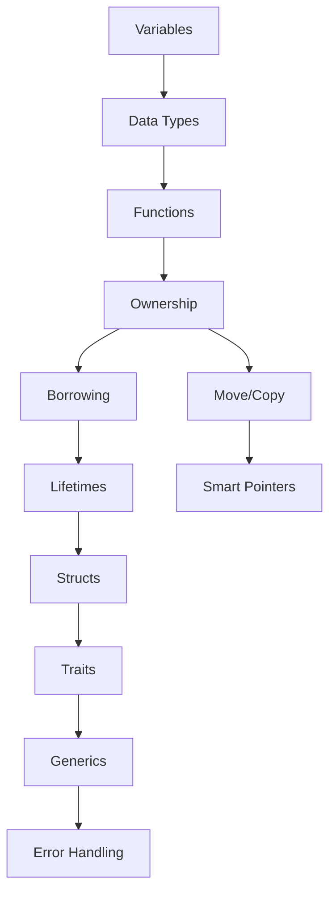

# 📚 Core Concepts Index

## 🎯 Навигация по основным концепциям

### 1. [[01_Core/01_Basics/00_Index|Основы языка]]
- [[01_Core/01_Basics/01_Variables|Переменные и мутабельность]]
- [[01_Core/01_Basics/02_Data_Types|Типы данных]]
- [[01_Core/01_Basics/03_Functions|Функции]]
- [[01_Core/01_Basics/04_Control_Flow|Управление потоком]]
- [[01_Core/01_Basics/05_Comments|Комментарии и документация]]

### 2. [[01_Core/02_Ownership/00_Index|Ownership System]]
- [[01_Core/02_Ownership/01_Ownership_Rules|Правила владения]]
- [[01_Core/02_Ownership/02_Memory_Stack_Heap|Stack vs Heap]]
- [[01_Core/02_Ownership/03_Move_Semantics|Move семантика]]
- [[01_Core/02_Ownership/04_Copy_Clone|Copy и Clone трейты]]

### 3. [[01_Core/03_Borrowing/00_Index|Borrowing & References]]
- [[01_Core/03_Borrowing/01_References|Ссылки и заимствование]]
- [[01_Core/03_Borrowing/02_Mutable_References|Изменяемые ссылки]]
- [[01_Core/03_Borrowing/03_Slices|Срезы (Slices)]]
- [[01_Core/03_Borrowing/04_Dangling_References|Висячие ссылки]]

### 4. [[01_Core/04_Lifetimes/00_Index|Lifetimes]]
- [[01_Core/04_Lifetimes/01_Lifetime_Basics|Основы времени жизни]]
- [[01_Core/04_Lifetimes/02_Lifetime_Annotations|Аннотации времени жизни]]
- [[01_Core/04_Lifetimes/03_Lifetime_Elision|Элизия времени жизни]]
- [[01_Core/04_Lifetimes/04_Static_Lifetime|'static время жизни]]

### 5. [[01_Core/05_Structs_Enums/00_Index|Структуры и Перечисления]]
- [[01_Core/05_Structs_Enums/01_Structs|Структуры]]
- [[01_Core/05_Structs_Enums/02_Enums|Перечисления]]
- [[01_Core/05_Structs_Enums/03_Pattern_Matching|Pattern Matching]]
- [[01_Core/05_Structs_Enums/04_Option_Result|Option и Result]]

### 6. [[01_Core/06_Traits/00_Index|Traits]]
- [[01_Core/06_Traits/01_Defining_Traits|Определение трейтов]]
- [[01_Core/06_Traits/02_Implementing_Traits|Реализация трейтов]]
- [[01_Core/06_Traits/03_Trait_Bounds|Trait Bounds]]
- [[01_Core/06_Traits/04_Trait_Objects|Trait Objects]]
- [[01_Core/06_Traits/05_Standard_Traits|Стандартные трейты]]

### 7. [[01_Core/07_Generics/00_Index|Generics]]
- [[01_Core/07_Generics/01_Generic_Functions|Обобщенные функции]]
- [[01_Core/07_Generics/02_Generic_Structs|Обобщенные структуры]]
- [[01_Core/07_Generics/03_Generic_Enums|Обобщенные енумы]]
- [[01_Core/07_Generics/04_Generic_Constraints|Ограничения дженериков]]

### 8. [[01_Core/08_Error_Handling/00_Index|Error Handling]]
- [[01_Core/08_Error_Handling/01_Panic|Panic!]]
- [[01_Core/08_Error_Handling/02_Result_Type|Тип Result]]
- [[01_Core/08_Error_Handling/03_Error_Propagation|Распространение ошибок]]
- [[01_Core/08_Error_Handling/04_Custom_Errors|Пользовательские ошибки]]

## 🔗 Граф связей концепций

## 📝 Заметки для изучения

> 💡 **Совет**: Начните с основ и постепенно переходите к более сложным концепциям. Каждая тема связана с предыдущей!

## 🎯 Практические задания

- [ ] Написать программу с различными типами переменных
- [ ] Реализовать структуру с методами
- [ ] Создать трейт и реализовать его для нескольких типов
- [ ] Написать функцию с дженериками и ограничениями

---
#rust #core #index
