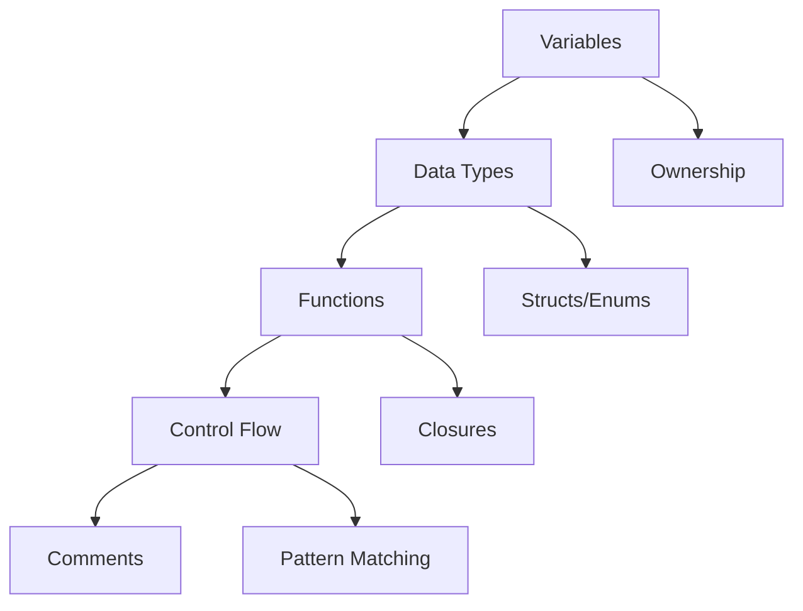

# 📝 Basics Overview

## 🎯 Фундаментальные концепции Rust

Этот раздел покрывает базовые элементы языка Rust, необходимые для начала программирования.

## 📚 Содержание раздела

### 1. [[01_Core/01_Basics/01_Variables|Variables and Mutability]]
- Объявление переменных
- Изменяемость (mut)
- Shadowing
- Константы и static переменные

### 2. [[01_Core/01_Basics/02_Data_Types|Data Types]]
- Скалярные типы (integers, floats, bool, char)
- Составные типы (tuples, arrays)
- Type annotations
- Type inference

### 3. [[01_Core/01_Basics/03_Functions|Functions]]
- Объявление функций
- Параметры и возвращаемые значения
- Expressions vs Statements
- Методы и ассоциированные функции

### 4. [[01_Core/01_Basics/04_Control_Flow|Control Flow]]
- if/else выражения
- Циклы (loop, while, for)
- Pattern matching с match
- if let и while let

### 5. [[01_Core/01_Basics/05_Comments|Comments and Documentation]]
- Обычные комментарии
- Документирующие комментарии
- Примеры в документации
- Атрибуты

## 🗺️ Карта изучения



## 🎯 Цели изучения

После изучения этого раздела вы сможете:

- ✅ Объявлять и использовать переменные
- ✅ Работать с базовыми типами данных
- ✅ Создавать и вызывать функции
- ✅ Управлять потоком выполнения программы
- ✅ Документировать код

## 💡 Ключевые концепции

### Неизменяемость по умолчанию
```rust
let x = 5;     // неизменяемая
let mut y = 5; // изменяемая
```

### Выведение типов
```rust
let x = 5;      // компилятор выводит i32
let y = 5.0;    // компилятор выводит f64
```

### Выражения vs Утверждения
```rust
let y = {
    let x = 3;
    x + 1  // выражение, возвращает 4
};
```

## 📝 Практический пример

```rust
// Комбинация базовых концепций
fn main() {
    // Variables
    let mut counter = 0;
    let limit = 10;
    
    // Function
    fn is_even(n: i32) -> bool {
        n % 2 == 0
    }
    
    // Control flow
    while counter < limit {
        if is_even(counter) {
            println!("Even: {}", counter);
        } else {
            println!("Odd: {}", counter);
        }
        counter += 1;
    }
    
    // Pattern matching
    let result = match counter {
        10 => "Reached the limit",
        _ => "Something went wrong",
    };
    
    println!("{}", result);
}
```

## 🎯 Упражнения для закрепления

1. **Calculator**: Создайте простой калькулятор с базовыми операциями
2. **Temperature Converter**: Конвертер температур (Celsius ↔ Fahrenheit)
3. **Number Guesser**: Игра "Угадай число"
4. **Fibonacci**: Генератор чисел Фибоначчи

## 📊 Проверка знаний

- [ ] Могу объявить переменные разных типов
- [ ] Понимаю разницу между mut и shadowing
- [ ] Умею создавать функции с параметрами
- [ ] Использую if, loop, while, for
- [ ] Применяю pattern matching

## 🔗 Следующие шаги

После освоения базовых концепций переходите к:

1. [[01_Core/02_Ownership/00_Index|Ownership System]] - уникальная система управления памятью
2. [[01_Core/03_Borrowing/00_Index|Borrowing & References]] - заимствование и ссылки
3. [[01_Core/05_Structs_Enums/00_Index|Structs & Enums]] - пользовательские типы

## 📚 Дополнительные ресурсы

- [Rust Book Ch. 3](https://doc.rust-lang.org/book/ch03-00-common-programming-concepts.html)
- [Rust by Example - Primitives](https://doc.rust-lang.org/rust-by-example/primitives.html)
- [[Rust Cheatsheet|Quick Reference]]

---
#rust #basics #core #fundamentals
