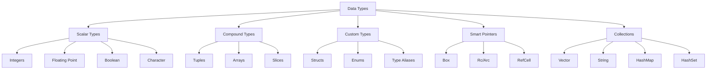

# 📊 Data Types Index

## 🎯 Полная карта типов данных в Rust

### 📋 Навигация по типам



## 📚 Содержание раздела

### 1. [[01_Core/01_Basics/02_Data_Types/01_Scalar_Types|Скалярные типы]]
- [[01_Core/01_Basics/02_Data_Types/01_Integers|Целые числа]]
- [[01_Core/01_Basics/02_Data_Types/02_Floating_Point|Числа с плавающей точкой]]
- [[01_Core/01_Basics/02_Data_Types/03_Boolean|Логический тип]]
- [[01_Core/01_Basics/02_Data_Types/04_Character|Символьный тип]]

### 2. [[01_Core/01_Basics/02_Data_Types/05_Compound_Types|Составные типы]]
- [[01_Core/01_Basics/02_Data_Types/06_Tuples|Кортежи]]
- [[01_Core/01_Basics/02_Data_Types/07_Arrays|Массивы]]
- [[01_Core/01_Basics/02_Data_Types/08_Slices|Срезы]]

### 3. [[01_Core/01_Basics/02_Data_Types/09_Strings|Строковые типы]]
- [[01_Core/01_Basics/02_Data_Types/10_String_vs_str|String vs &str]]
- [[01_Core/01_Basics/02_Data_Types/11_String_Operations|Операции со строками]]

### 4. [[01_Core/01_Basics/02_Data_Types/12_Collections|Коллекции]]
- [[01_Core/01_Basics/02_Data_Types/13_Vectors|Векторы]]
- [[01_Core/01_Basics/02_Data_Types/14_HashMap|HashMap]]
- [[01_Core/01_Basics/02_Data_Types/15_HashSet|HashSet]]

### 5. [[01_Core/01_Basics/02_Data_Types/16_Type_Conversion|Преобразование типов]]
- [[01_Core/01_Basics/02_Data_Types/17_Type_Casting|Приведение типов]]
- [[01_Core/01_Basics/02_Data_Types/18_From_Into|From и Into traits]]

## 🔗 Связи с другими концепциями

- [[01_Core/02_Ownership/00_Index|Ownership]] - как типы влияют на владение
- [[01_Core/06_Traits/00_Index|Traits]] - поведение типов
- [[01_Core/07_Generics/00_Index|Generics]] - обобщенные типы
- [[02_Advanced/03_Smart_Pointers/00_Index|Smart Pointers]] - продвинутые типы

## 📊 Сравнительная таблица типов

| Тип | Размер | Stack/Heap | Copy | Clone | Пример |
|-----|--------|------------|------|-------|--------|
| i32 | 4 bytes | Stack | ✅ | ✅ | `42` |
| String | variable | Heap | ❌ | ✅ | `String::from("hello")` |
| &str | pointer | Stack | ✅ | ✅ | `"hello"` |
| Vec<T> | variable | Heap | ❌ | ✅ | `vec![1, 2, 3]` |
| [T; N] | N * size_of::<T>() | Stack | Depends on T | Depends on T | `[1, 2, 3]` |

## 🎯 Быстрый справочник

```rust
// Скалярные типы
let integer: i32 = 42;
let float: f64 = 3.14;
let boolean: bool = true;
let character: char = '🦀';

// Составные типы
let tuple: (i32, f64, char) = (42, 3.14, 'a');
let array: [i32; 3] = [1, 2, 3];
let slice: &[i32] = &array[1..];

// Строки
let string: String = String::from("owned");
let str_slice: &str = "borrowed";

// Коллекции
let vector: Vec<i32> = vec![1, 2, 3];
let mut map: HashMap<String, i32> = HashMap::new();
```

---
#rust #types #data-types #core
