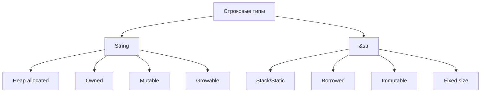

# 🔤 String vs &str - Строковые типы

## 📋 Обзор строковых типов в Rust

В Rust есть два основных строковых типа:
- `String` - владеющий, изменяемый, растущий
- `&str` - заимствованный срез, неизменяемый



## 🔍 Детальное сравнение

| Характеристика | String | &str |
|---------------|--------|------|
| **Владение** | Владеет данными | Заимствует данные |
| **Расположение** | Heap | Stack/Static/Heap reference |
| **Изменяемость** | Может быть mut | Всегда immutable |
| **Размер** | Может расти | Фиксированный |
| **Создание** | `String::from()`, `to_string()` | Литералы, слайсы |
| **Производительность** | Выделение памяти | Без выделения |
| **Use case** | Когда нужно владение/изменение | Для чтения/передачи |

## 💻 String - Владеющий тип

### Создание String
```rust
// Различные способы создания String
let s1 = String::new();                    // Пустая строка
let s2 = String::from("hello");           // Из &str
let s3 = "world".to_string();             // Метод to_string()
let s4 = "rust".to_owned();               // Метод to_owned()
let s5 = format!("{} {}", "hello", "world"); // Макрос format!

// Из байтов
let s6 = String::from_utf8(vec![72, 101, 108, 108, 111]).unwrap();
let s7 = String::from_utf8_lossy(&[72, 101, 255, 108, 111]); // С заменой невалидных

// С предварительным выделением capacity
let mut s8 = String::with_capacity(25);
```

### Модификация String
```rust
let mut s = String::from("Hello");

// Добавление
s.push(' ');                    // Добавить char
s.push_str("World");            // Добавить &str
s += "!";                       // Оператор +=

// Вставка
s.insert(5, ',');               // Вставить char по индексу
s.insert_str(6, " beautiful");  // Вставить &str по индексу

// Удаление
s.pop();                        // Удалить последний char
s.remove(0);                    // Удалить char по индексу
s.truncate(5);                  // Обрезать до длины
s.clear();                      // Очистить

// Замена
let new_s = s.replace("World", "Rust");
let new_s = s.replacen("l", "L", 2); // Заменить первые n вхождений
```

### String методы
```rust
let s = String::from("  Hello, World!  ");

// Обрезка пробелов
let trimmed = s.trim();            // "Hello, World!"
let trim_start = s.trim_start();   // "Hello, World!  "
let trim_end = s.trim_end();       // "  Hello, World!"

// Преобразование регистра
let upper = s.to_uppercase();      // "  HELLO, WORLD!  "
let lower = s.to_lowercase();      // "  hello, world!  "

// Проверки
let is_empty = s.is_empty();       // false
let starts = s.starts_with("  H"); // true
let ends = s.ends_with("!  ");     // true
let contains = s.contains("World"); // true

// Информация
let len_bytes = s.len();           // Длина в байтах
let len_chars = s.chars().count(); // Длина в символах
let capacity = s.capacity();       // Выделенная емкость
```

## 📝 &str - Строковый срез

### Создание &str
```rust
// Строковые литералы
let s1: &str = "Hello, World!";    // &'static str

// Из String
let owned = String::from("Rust");
let borrowed: &str = &owned;       // Заимствование всей строки
let slice: &str = &owned[0..2];    // Срез "Ru"

// Из массива байтов
let bytes = b"Hello";
let s2 = std::str::from_utf8(bytes).unwrap();

// Статические строки
static GLOBAL: &str = "I'm global";
const CONSTANT: &str = "I'm constant";
```

### Операции с &str
```rust
let s = "Hello, World!";

// Итерация
for ch in s.chars() {
    println!("{}", ch);            // Итерация по символам
}

for byte in s.bytes() {
    println!("{}", byte);           // Итерация по байтам
}

// Разделение
let words: Vec<&str> = s.split_whitespace().collect();
let parts: Vec<&str> = s.split(',').collect();
let lines: Vec<&str> = s.lines().collect();

// Поиск
let pos = s.find("World");         // Some(7)
let rpos = s.rfind('o');          // Some(8) - с конца
let matches: Vec<_> = s.match_indices('l').collect();

// Извлечение подстрок
let substring = &s[7..12];         // "World" - ОСТОРОЖНО с границами!
let safe_get = s.get(7..12);      // Some("World") - безопасно
```

## 🔄 Конвертация между типами

### String ↔ &str
```rust
// &str -> String
let s: &str = "hello";
let owned1: String = s.to_string();
let owned2: String = String::from(s);
let owned3: String = s.to_owned();
let owned4: String = format!("{}", s);

// String -> &str
let owned = String::from("world");
let borrowed1: &str = &owned;      // Deref coercion
let borrowed2: &str = owned.as_str();
let borrowed3: &str = &owned[..];  // Полный срез
```

### Deref Coercion
```rust
fn takes_str(s: &str) {
    println!("{}", s);
}

let owned = String::from("Rust");
takes_str(&owned);  // String автоматически deref в &str

// Это работает благодаря impl Deref для String
use std::ops::Deref;
// impl Deref for String {
//     type Target = str;
//     ...
// }
```

## ⚠️ UTF-8 и индексация

### Проблема с индексацией
```rust
let s = "Здравствуй";

// ❌ НЕЛЬЗЯ индексировать напрямую
// let ch = s[0]; // ОШИБКА: не реализован Index

// ✅ Правильные способы
let first_char = s.chars().next();        // Some('З')
let first_byte = s.bytes().next();        // Some(208)

// Срезы должны быть по границам символов
// let slice = &s[0..1]; // ПАНИКА! Не на границе символа
let slice = &s[0..2];    // "З" - занимает 2 байта

// Безопасное получение среза
if let Some(slice) = s.get(0..2) {
    println!("{}", slice); // "З"
}
```

### Работа с Unicode
```rust
let emoji = "Hello 🦀 Rust!";

// Длина в байтах vs символах
println!("Bytes: {}", emoji.len());        // 15 байт
println!("Chars: {}", emoji.chars().count()); // 13 символов

// Итерация по графемам (требует внешний крейт)
// use unicode_segmentation::UnicodeSegmentation;
// for g in emoji.graphemes(true) {
//     println!("{}", g);
// }

// Проверка валидности UTF-8
let valid_utf8 = str::from_utf8(&[72, 101, 108, 108, 111]);
let invalid_utf8 = str::from_utf8(&[0xFF, 0xFE]);
```

## 🎯 Когда использовать String vs &str

### Используйте String когда:
- Нужно владеть строкой
- Строка создается/модифицируется во время выполнения
- Нужно передать владение
- Строка должна пережить создавшую её функцию

```rust
fn create_greeting(name: &str) -> String {
    format!("Hello, {}!", name)  // Возвращаем владение
}

struct Person {
    name: String,  // Структура владеет именем
}
```

### Используйте &str когда:
- Только читаете строку
- Принимаете строку как параметр
- Работаете со строковыми литералами
- Хотите избежать выделения памяти

```rust
fn print_message(msg: &str) {  // Принимаем любую строку
    println!("{}", msg);
}

const ERROR_MSG: &str = "Something went wrong"; // Константа
```

## 📊 Производительность

```rust
use std::time::Instant;

// String allocation - медленнее
let start = Instant::now();
for _ in 0..1000 {
    let _s = String::from("test");
}
println!("String: {:?}", start.elapsed());

// &str - быстрее
let start = Instant::now();
for _ in 0..1000 {
    let _s: &str = "test";
}
println!("&str: {:?}", start.elapsed());
```

## 🎯 Флеш-карточки

#flashcard 
Q: В чем главное отличие String от &str?
A: String владеет данными и может изменяться, &str заимствует и неизменяем
<!--SR:!2024-03-04,4,270-->

#flashcard 
Q: Где хранятся данные String и &str?
A: String хранит данные в heap, &str - ссылка на данные в heap/static/stack
<!--SR:!2024-03-05,5,280-->

#flashcard 
Q: Как конвертировать &str в String?
A: to_string(), String::from(), to_owned(), format!()
<!--SR:!2024-03-06,3,250-->

## 🔗 Связанные темы

- [[01_Core/02_Ownership/01_Ownership_Rules|Ownership]] - владение строками
- [[01_Core/03_Borrowing/01_References|Borrowing]] - заимствование строк
- [[01_Core/01_Basics/02_Data_Types/11_String_Operations|String Operations]] - операции со строками
- [[01_Core/01_Basics/02_Data_Types/08_Slices|Slices]] - срезы и их использование

---
#rust #strings #string #str #utf8 #types
