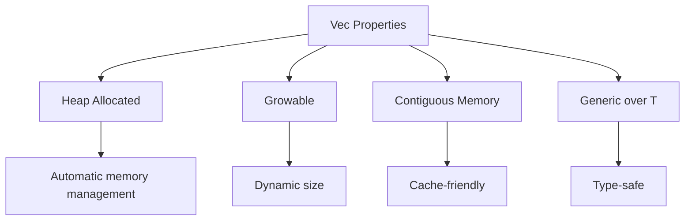

# 📦 Vectors - Динамические массивы

## 📋 Обзор Vec<T>

`Vec<T>` - это динамический массив, который может изменять свой размер. Это одна из самых используемых коллекций в Rust.



### Характеристики Vec
- **Расположение**: Heap
- **Размер**: Динамический
- **Память**: Непрерывная
- **Владение**: Владеет элементами
- **Производительность**: O(1) доступ по индексу, O(1) push/pop в конце

## 💻 Создание векторов

### Различные способы создания
```rust
// Пустой вектор
let v1: Vec<i32> = Vec::new();
let v2 = Vec::<i32>::new();
let mut v3: Vec<i32> = vec![];

// С начальными элементами
let v4 = vec![1, 2, 3, 4, 5];
let v5 = vec![0; 10];              // 10 элементов со значением 0

// С предварительным выделением capacity
let mut v6 = Vec::with_capacity(100);

// Из итератора
let v7: Vec<i32> = (0..10).collect();
let v8: Vec<_> = [1, 2, 3].iter().cloned().collect();

// Из среза
let slice = &[1, 2, 3];
let v9 = slice.to_vec();
let v10 = Vec::from(slice);
```

### Макрос vec!
```rust
// Простое создание
let v = vec![1, 2, 3];

// С повторением
let v = vec![0; 5];  // [0, 0, 0, 0, 0]

// С вычислениями
let v = vec![1 + 1, 2 * 2, 3 * 3];  // [2, 4, 9]

// Многострочный
let v = vec![
    "apple",
    "banana",
    "cherry",
];
```

## 🔧 Основные операции

### Добавление элементов
```rust
let mut v = vec![1, 2, 3];

// В конец
v.push(4);                          // [1, 2, 3, 4]
v.append(&mut vec![5, 6]);         // [1, 2, 3, 4, 5, 6]
v.extend([7, 8].iter().cloned());  // [1, 2, 3, 4, 5, 6, 7, 8]

// В произвольную позицию
v.insert(0, 0);                    // [0, 1, 2, 3, 4, 5, 6, 7, 8]
v.splice(2..4, vec![10, 11]);      // Заменить диапазон

// Resize
v.resize(5, 0);                    // Изменить размер, заполнить значением
v.resize_with(10, Default::default); // С функцией-генератором
```

### Удаление элементов
```rust
let mut v = vec![1, 2, 3, 4, 5];

// Из конца
let last = v.pop();                // Some(5), v = [1, 2, 3, 4]

// По индексу
let removed = v.remove(1);         // 2, v = [1, 3, 4]
let swapped = v.swap_remove(0);    // 1, v = [4, 3] (быстрее remove)

// Очистка
v.clear();                         // v = []
v.truncate(2);                     // Обрезать до длины

// Удаление по условию
v.retain(|&x| x % 2 == 0);        // Оставить только четные
v.dedup();                         // Удалить последовательные дубликаты
```

### Доступ к элементам
```rust
let v = vec![1, 2, 3, 4, 5];

// По индексу
let third = v[2];                  // 3 (может паниковать)
let safe = v.get(2);              // Some(3) (безопасно)

// Первый и последний
let first = v.first();             // Some(1)
let last = v.last();               // Some(5)

// Срезы
let slice = &v[1..3];              // [2, 3]
let all = &v[..];                  // Весь вектор как срез

// Изменяемый доступ
let mut v = vec![1, 2, 3];
v[0] = 10;
if let Some(elem) = v.get_mut(1) {
    *elem = 20;
}
```

## 🔄 Итерация

### Различные виды итераторов
```rust
let mut v = vec![1, 2, 3, 4, 5];

// Неизменяемая итерация
for item in &v {
    println!("{}", item);          // Заимствование
}

// Изменяемая итерация
for item in &mut v {
    *item *= 2;                    // Изменение элементов
}

// Потребляющая итерация
for item in v {
    println!("{}", item);          // v больше не доступен
}

// Итераторы
let iter = v.iter();               // Iterator<Item = &T>
let iter_mut = v.iter_mut();       // Iterator<Item = &mut T>
let into_iter = v.into_iter();     // Iterator<Item = T>

// С индексами
for (index, value) in v.iter().enumerate() {
    println!("{}: {}", index, value);
}

// Chunks
for chunk in v.chunks(2) {
    println!("{:?}", chunk);       // [1, 2], [3, 4], [5]
}

// Windows
for window in v.windows(3) {
    println!("{:?}", window);      // [1, 2, 3], [2, 3, 4], [3, 4, 5]
}
```

## 🎨 Методы преобразования

### Map, Filter, Fold
```rust
let v = vec![1, 2, 3, 4, 5];

// Map - преобразование
let doubled: Vec<i32> = v.iter().map(|x| x * 2).collect();

// Filter - фильтрация
let evens: Vec<i32> = v.iter()
    .filter(|&&x| x % 2 == 0)
    .cloned()
    .collect();

// Fold - свертка
let sum = v.iter().fold(0, |acc, x| acc + x);

// Комбинирование
let result: Vec<i32> = v.iter()
    .map(|x| x * 2)
    .filter(|x| x > &5)
    .take(3)
    .collect();

// Flat map
let nested = vec![vec![1, 2], vec![3, 4]];
let flat: Vec<i32> = nested.into_iter()
    .flat_map(|x| x)
    .collect();
```

### Сортировка и поиск
```rust
let mut v = vec![3, 1, 4, 1, 5, 9, 2, 6];

// Сортировка
v.sort();                          // По возрастанию
v.sort_by(|a, b| b.cmp(a));       // По убыванию
v.sort_by_key(|x| -x);             // По ключу

// Для float или нестабильная
v.sort_unstable();                 // Быстрее, но не сохраняет порядок равных

// Поиск
let pos = v.iter().position(|&x| x == 4);  // Индекс первого
let rpos = v.iter().rposition(|&x| x == 1); // Индекс последнего
let found = v.binary_search(&5);           // Требует отсортированный

// Min/Max
let min = v.iter().min();
let max = v.iter().max();
let minmax = v.iter().minmax();   // Требует itertools
```

## 📊 Capacity и производительность

### Управление capacity
```rust
let mut v = Vec::with_capacity(10);

println!("Length: {}", v.len());       // 0
println!("Capacity: {}", v.capacity()); // 10

// Добавляем элементы
for i in 0..5 {
    v.push(i);
}

println!("Length: {}", v.len());       // 5
println!("Capacity: {}", v.capacity()); // 10

// Резервирование дополнительного места
v.reserve(20);                         // Гарантирует минимум 20 дополнительных
v.reserve_exact(30);                   // Точно 30 дополнительных

// Освобождение неиспользуемой памяти
v.shrink_to_fit();                    // capacity = len
v.shrink_to(8);                       // Уменьшить до указанного
```

### Стратегия роста
```rust
// Vec удваивает capacity при необходимости
let mut v = Vec::new();
let mut prev_cap = v.capacity();

for i in 0..100 {
    v.push(i);
    let new_cap = v.capacity();
    if new_cap != prev_cap {
        println!("Capacity changed: {} -> {}", prev_cap, new_cap);
        prev_cap = new_cap;
    }
}
// Output: 0 -> 4 -> 8 -> 16 -> 32 -> 64 -> 128
```

## ⚠️ Частые проблемы и решения

### Проблема 1: Паника при индексации
```rust
let v = vec![1, 2, 3];

// ❌ Может паниковать
let item = v[10];  // panic!

// ✅ Безопасный доступ
if let Some(item) = v.get(10) {
    println!("{}", item);
} else {
    println!("Index out of bounds");
}
```

### Проблема 2: Инвалидация ссылок
```rust
let mut v = vec![1, 2, 3];

// ❌ Ссылка становится невалидной
let first = &v[0];
v.push(4);  // Может перевыделить память
// println!("{}", first); // ОШИБКА: borrow checker

// ✅ Правильный порядок
v.push(4);
let first = &v[0];
println!("{}", first);
```

### Проблема 3: Неэффективное выделение памяти
```rust
// ❌ Много перевыделений
let mut v = Vec::new();
for i in 0..1000 {
    v.push(i);  // Много реаллокаций
}

// ✅ Предварительное выделение
let mut v = Vec::with_capacity(1000);
for i in 0..1000 {
    v.push(i);  // Без реаллокаций
}
```

## 🎯 Best Practices

### 1. Используйте with_capacity когда знаете размер
```rust
// Плохо
let mut v = Vec::new();
for i in 0..known_size {
    v.push(compute(i));
}

// Хорошо
let mut v = Vec::with_capacity(known_size);
for i in 0..known_size {
    v.push(compute(i));
}
```

### 2. Предпочитайте итераторы циклам
```rust
// Менее идиоматично
let mut result = Vec::new();
for x in &input {
    if x > &0 {
        result.push(x * 2);
    }
}

// Идиоматично
let result: Vec<_> = input.iter()
    .filter(|&&x| x > 0)
    .map(|x| x * 2)
    .collect();
```

### 3. Используйте правильный метод удаления
```rust
// remove - O(n), сохраняет порядок
v.remove(index);

// swap_remove - O(1), не сохраняет порядок
v.swap_remove(index);

// Выбирайте в зависимости от требований
```

## 🎯 Флеш-карточки

#flashcard 
Q: Где Vec<T> хранит свои данные?
A: В heap, в непрерывной области памяти
<!--SR:!2024-03-07,4,270-->

#flashcard 
Q: Какая сложность доступа к элементу Vec по индексу?
A: O(1) - константная
<!--SR:!2024-03-08,5,280-->

#flashcard 
Q: В чем разница между len() и capacity()?
A: len() - количество элементов, capacity() - выделенная память
<!--SR:!2024-03-09,3,250-->

## 🔗 Связанные темы

- [[01_Core/01_Basics/02_Data_Types/07_Arrays|Arrays]] - статические массивы
- [[01_Core/01_Basics/02_Data_Types/08_Slices|Slices]] - срезы
- [[01_Core/01_Basics/02_Data_Types/14_HashMap|HashMap]] - ассоциативные массивы
- [[01_Core/02_Ownership/01_Ownership_Rules|Ownership]] - владение элементами

---
#rust #vector #vec #collections #dynamic-array
