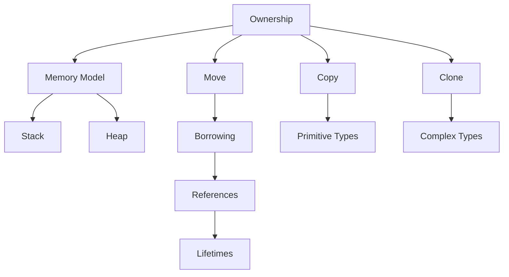

# 🔑 Ownership System Overview

## 🎯 Система владения в Rust

Ownership - это уникальная система Rust для управления памятью без сборщика мусора и без явного выделения/освобождения памяти.

## 📚 Содержание раздела

### 1. [[01_Core/02_Ownership/01_Ownership_Rules|Ownership Rules]]
- Три правила владения
- Область видимости (Scope)
- Drop trait

### 2. [[01_Core/02_Ownership/02_Memory_Stack_Heap|Stack vs Heap]]
- Различия между стеком и кучей
- Что хранится где
- Производительность

### 3. [[01_Core/02_Ownership/03_Move_Semantics|Move Semantics]]
- Что такое Move
- Move vs Copy
- Partial moves

### 4. [[01_Core/02_Ownership/04_Copy_Clone|Copy and Clone Traits]]
- Copy trait для стековых типов
- Clone для глубокого копирования
- Реализация собственных Copy/Clone

## 🗺️ Концептуальная карта



## 🎓 Три правила владения

### Правило 1: У каждого значения есть владелец
```rust
let s = String::from("hello"); // s владеет строкой
```

### Правило 2: Только один владелец одновременно
```rust
let s1 = String::from("hello");
let s2 = s1; // s1 больше не валидна, s2 - новый владелец
```

### Правило 3: Когда владелец выходит из scope, значение удаляется
```rust
{
    let s = String::from("hello"); // s валидна
    // используем s
} // s выходит из scope и память освобождается
```

## 💡 Ключевые концепции

### Move по умолчанию
```rust
let x = vec![1, 2, 3];
let y = x; // x moved to y
// println!("{:?}", x); // ОШИБКА!
```

### Copy для простых типов
```rust
let x = 5;
let y = x; // x copied to y
println!("x = {}, y = {}", x, y); // Оба валидны
```

### Clone для явного копирования
```rust
let s1 = String::from("hello");
let s2 = s1.clone();
println!("s1 = {}, s2 = {}", s1, s2); // Оба валидны
```

## 📊 Сравнительная таблица

| Аспект | Copy | Move | Clone |
|--------|------|------|-------|
| Скорость | Быстро | Быстро | Медленно |
| Память | Стек | Передача владения | Новая аллокация |
| Применение | Примитивы | По умолчанию | Явное копирование |
| Пример | `i32, bool` | `String, Vec` | `.clone()` |

## 💻 Практический пример

```rust
#[derive(Debug)]
struct Person {
    name: String,
    age: u32,
}

fn main() {
    // Move семантика
    let person1 = Person {
        name: String::from("Alice"),
        age: 30,
    };
    
    let person2 = person1; // person1 moved
    // println!("{:?}", person1); // ОШИБКА!
    
    // Clone для копирования
    let person3 = Person {
        name: String::from("Bob"),
        age: 25,
    };
    
    let person4 = Person {
        name: person3.name.clone(), // Явное клонирование
        age: person3.age, // Copy для u32
    };
    
    println!("{:?}", person3); // OK
    println!("{:?}", person4); // OK
}
```

## 🎯 Практические задания

1. **Memory Analyzer**: Напишите функцию, показывающую размещение в памяти
2. **Move Tracker**: Отследите передачу владения в цепочке функций
3. **Clone Counter**: Подсчитайте количество клонирований в программе
4. **Custom Types**: Реализуйте Copy и Clone для своих типов

## 📊 Проверка понимания

- [ ] Понимаю три правила владения
- [ ] Знаю разницу между Stack и Heap
- [ ] Могу предсказать, где произойдет Move
- [ ] Умею использовать Clone осознанно
- [ ] Понимаю, когда вызывается Drop

## ⚠️ Частые ошибки

### Ошибка: use after move
```rust
let s = String::from("hello");
process(s);
println!("{}", s); // ОШИБКА: value used after move
```

### Решения:
1. Клонирование: `process(s.clone())`
2. Заимствование: `process(&s)`
3. Возврат владения: `let s = process(s)`

## 🔗 Связанные темы

- [[01_Core/03_Borrowing/00_Index|Borrowing & References]] - использование без владения
- [[01_Core/04_Lifetimes/00_Index|Lifetimes]] - время жизни ссылок
- [[02_Advanced/03_Smart_Pointers/00_Index|Smart Pointers]] - продвинутое управление памятью

## 📚 Ресурсы для углубления

- [Rust Book Ch. 4](https://doc.rust-lang.org/book/ch04-00-understanding-ownership.html)
- [Visualizing Memory](https://github.com/usagi/rust-memory-container-cs)
- [[Common Errors|Common Ownership Errors]]

---
#rust #ownership #memory #core
