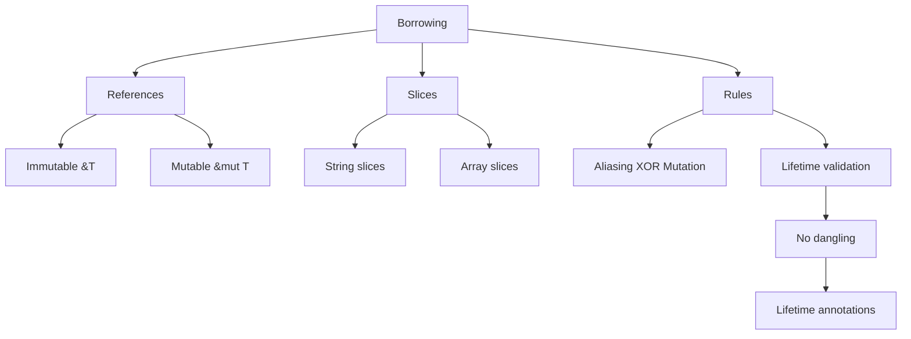

# 🔗 Borrowing & References Overview

## 🎯 Система заимствования в Rust

Borrowing позволяет использовать данные без передачи владения, обеспечивая безопасность памяти во время компиляции.

## 📚 Содержание раздела

### 1. [[01_Core/03_Borrowing/01_References|References]]
- Неизменяемые ссылки (&T)
- Изменяемые ссылки (&mut T)
- Правила заимствования

### 2. [[01_Core/03_Borrowing/02_Mutable_References|Mutable References]]
- Эксклюзивность изменяемых ссылок
- Области видимости ссылок
- Паттерны использования

### 3. [[01_Core/03_Borrowing/03_Slices|Slices]]
- Строковые срезы (&str)
- Срезы массивов (&[T])
- Динамические срезы

### 4. [[01_Core/03_Borrowing/04_Dangling_References|Dangling References]]
- Что такое висячие ссылки
- Как Rust предотвращает их
- Lifetime система

## 🔐 Правила заимствования

### Правило 1: Множественные неизменяемые ИЛИ одна изменяемая
```rust
let mut s = String::from("hello");

// ✅ Множественные неизменяемые
let r1 = &s;
let r2 = &s;
println!("{} and {}", r1, r2);

// ❌ Нельзя изменяемую при наличии неизменяемых
// let r3 = &mut s; // ОШИБКА!
```

### Правило 2: Ссылки должны быть валидными
```rust
// ❌ Висячая ссылка
fn dangle() -> &String {
    let s = String::from("hello");
    &s // s будет удалена!
}

// ✅ Возвращаем владение
fn no_dangle() -> String {
    let s = String::from("hello");
    s
}
```

## 📊 Виды ссылок

| Тип | Синтаксис | Количество | Изменение |
|-----|-----------|------------|-----------|
| Неизменяемая | `&T` | Много | Нет |
| Изменяемая | `&mut T` | Одна | Да |
| Сырая неизменяемая | `*const T` | Много | Unsafe |
| Сырая изменяемая | `*mut T` | Много | Unsafe |

## 🗺️ Концептуальная карта



## 💻 Практические примеры

### Пример 1: Функции с заимствованием
```rust
fn main() {
    let s1 = String::from("hello");
    
    let len = calculate_length(&s1);
    println!("The length of '{}' is {}.", s1, len);
    
    let mut s2 = String::from("hello");
    change(&mut s2);
    println!("Changed: {}", s2);
}

fn calculate_length(s: &String) -> usize {
    s.len()
} // s выходит из scope, но не владеет данными

fn change(s: &mut String) {
    s.push_str(", world");
}
```

### Пример 2: Множественные ссылки
```rust
fn main() {
    let mut data = vec![1, 2, 3, 4, 5];
    
    // Scope для изменяемой ссылки
    {
        let r = &mut data;
        r.push(6);
    } // r выходит из scope
    
    // Теперь можем создать неизменяемые
    let r1 = &data;
    let r2 = &data;
    println!("{:?} {:?}", r1, r2);
}
```

### Пример 3: Паттерн split borrowing
```rust
struct Container {
    a: String,
    b: String,
}

impl Container {
    fn split_borrow(&mut self) -> (&str, &mut String) {
        (&self.a, &mut self.b)
    }
}

fn main() {
    let mut c = Container {
        a: String::from("immutable"),
        b: String::from("mutable"),
    };
    
    let (immut, mut_ref) = c.split_borrow();
    mut_ref.push_str(" modified");
    println!("{} {}", immut, mut_ref);
}
```

## 🎯 Проверка понимания

- [ ] Понимаю правила заимствования
- [ ] Могу использовать &T и &mut T
- [ ] Знаю, что такое dangling references
- [ ] Умею работать со слайсами
- [ ] Понимаю Non-Lexical Lifetimes

## ⚠️ Частые ошибки

### Ошибка: Множественные изменяемые ссылки
```rust
// ❌ ОШИБКА
let mut s = String::from("hello");
let r1 = &mut s;
let r2 = &mut s; // cannot borrow as mutable more than once

// ✅ Решение: использовать scope
{
    let r1 = &mut s;
} // r1 выходит из scope
let r2 = &mut s; // OK
```

### Ошибка: Изменяемая и неизменяемая одновременно
```rust
// ❌ ОШИБКА
let mut s = String::from("hello");
let r1 = &s;
let r2 = &mut s; // cannot borrow as mutable
println!("{}", r1);

// ✅ Решение: завершить использование неизменяемых
let r1 = &s;
println!("{}", r1); // последнее использование r1
let r2 = &mut s; // OK
```

## 📝 Упражнения

1. **Reference Counter**: Реализуйте функцию, подсчитывающую ссылки
2. **Safe Split**: Создайте безопасное разделение строки
3. **Iterator Borrowing**: Работа с заимствованными итераторами
4. **Lifetime Puzzle**: Решите задачи с временем жизни

## 🔗 Следующие шаги

- [[01_Core/04_Lifetimes/00_Index|Lifetimes]] - время жизни ссылок
- [[02_Advanced/03_Smart_Pointers/04_RefCell|Interior Mutability]] - изменяемость через &T
- [[01_Core/06_Traits/00_Index|Traits]] - Borrow и AsRef traits

## 📚 Ресурсы

- [Rust Book Ch. 4.2](https://doc.rust-lang.org/book/ch04-02-references-and-borrowing.html)
- [Nomicon - References](https://doc.rust-lang.org/nomicon/references.html)
- [[Common Errors|Common Borrowing Errors]]

---
#rust #borrowing #references #core
