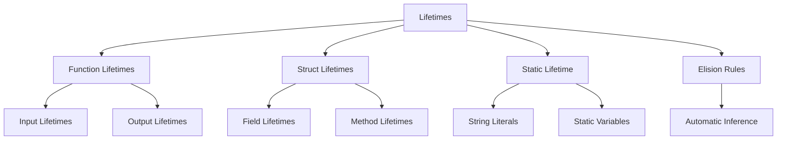

# 🕐 Lifetimes Overview

## 🎯 Время жизни в Rust

Lifetimes - это способ Rust отслеживать, как долго ссылки остаются валидными. Это ключевая часть системы безопасности памяти.

## 📚 Содержание раздела

### 1. [[01_Core/04_Lifetimes/01_Lifetime_Basics|Lifetime Basics]]
- Что такое lifetimes
- Зачем они нужны
- Неявные lifetimes

### 2. [[01_Core/04_Lifetimes/02_Lifetime_Annotations|Lifetime Annotations]]
- Синтаксис аннотаций
- Lifetimes в функциях
- Lifetimes в структурах

### 3. [[01_Core/04_Lifetimes/03_Lifetime_Elision|Lifetime Elision]]
- Правила элизии
- Когда аннотации не нужны
- Паттерны элизии

### 4. [[01_Core/04_Lifetimes/04_Static_Lifetime|'static Lifetime]]
- Что такое 'static
- Статические ссылки
- Когда использовать

## 🔍 Зачем нужны Lifetimes?

Lifetimes предотвращают dangling references:

```rust
// ❌ Без lifetimes это бы скомпилировалось
{
    let r;
    {
        let x = 5;
        r = &x; // x живет меньше чем r!
    }
    // println!("{}", r); // dangling reference!
}
```

## 📊 Синтаксис Lifetimes

### В функциях
```rust
fn longest<'a>(x: &'a str, y: &'a str) -> &'a str {
    if x.len() > y.len() { x } else { y }
}
```

### В структурах
```rust
struct ImportantExcerpt<'a> {
    part: &'a str,
}
```

### В impl блоках
```rust
impl<'a> ImportantExcerpt<'a> {
    fn level(&self) -> i32 {
        3
    }
    
    fn announce_and_return_part(&self, announcement: &str) -> &str {
        println!("Attention please: {}", announcement);
        self.part
    }
}
```

## 🗺️ Концептуальная карта



## 📐 Правила Lifetime

### Правило 1: Каждая ссылка имеет lifetime
```rust
&i32        // ссылка
&'a i32     // ссылка с явным lifetime 'a
&'a mut i32 // изменяемая ссылка с lifetime 'a
```

### Правило 2: Два типа lifetime параметров
1. **Input lifetimes** - параметры функции
2. **Output lifetimes** - возвращаемые значения

### Правило 3: Lifetime должен быть минимальным из всех связанных
```rust
fn shortest_lifetime<'a, 'b>(x: &'a str, y: &'b str) -> &'a str 
where 'b: 'a // 'b живет как минимум столько же, сколько 'a
{
    x
}
```

## 💻 Практические примеры

### Пример 1: Сравнение lifetimes
```rust
fn main() {
    let string1 = String::from("long string is long");
    let result;
    {
        let string2 = String::from("xyz");
        result = longest(string1.as_str(), string2.as_str());
        println!("Longest: {}", result); // OK здесь
    }
    // println!("{}", result); // ОШИБКА: string2 не живет достаточно долго
}

fn longest<'a>(x: &'a str, y: &'a str) -> &'a str {
    if x.len() > y.len() { x } else { y }
}
```

### Пример 2: Структуры с lifetimes
```rust
#[derive(Debug)]
struct Book<'a> {
    title: &'a str,
    author: &'a str,
}

impl<'a> Book<'a> {
    fn new(title: &'a str, author: &'a str) -> Self {
        Book { title, author }
    }
}

fn main() {
    let title = String::from("Rust Book");
    let author = String::from("Steve & Carol");
    
    let book = Book::new(&title, &author);
    println!("{:?}", book);
}
```

### Пример 3: Multiple lifetimes
```rust
struct Context<'s> {
    text: &'s str,
}

struct Parser<'c, 's: 'c> {
    context: &'c Context<'s>,
}

impl<'c, 's> Parser<'c, 's> {
    fn parse(&self) -> Result<(), &'s str> {
        Err(&self.context.text[1..])
    }
}
```

## 🎯 Lifetime Elision Rules

Компилятор применяет три правила:

1. **Каждый параметр-ссылка получает свой lifetime**
```rust
fn foo(x: &i32, y: &i32) // становится
fn foo<'a, 'b>(x: &'a i32, y: &'b i32)
```

2. **Если один input lifetime, он присваивается всем output**
```rust
fn foo(x: &i32) -> &i32 // становится
fn foo<'a>(x: &'a i32) -> &'a i32
```

3. **Если &self или &mut self, его lifetime присваивается output**
```rust
impl Struct {
    fn method(&self, x: &str) -> &str // становится
    fn method<'a, 'b>(&'a self, x: &'b str) -> &'a str
}
```

## 🎯 Проверка понимания

- [ ] Понимаю, зачем нужны lifetimes
- [ ] Могу читать lifetime аннотации
- [ ] Умею писать функции с lifetimes
- [ ] Знаю правила элизии
- [ ] Понимаю 'static lifetime

## ⚠️ Частые ошибки

### Ошибка: Несоответствие lifetimes
```rust
// ❌ ОШИБКА
fn invalid<'a>(x: &str) -> &'a str {
    let result = String::from("hi");
    &result // result не живет достаточно долго!
}

// ✅ Решение: вернуть owned тип
fn valid(x: &str) -> String {
    String::from("hi")
}
```

### Ошибка: Излишние lifetime параметры
```rust
// ❌ Избыточно
fn print<'a>(s: &'a str) {
    println!("{}", s);
}

// ✅ Достаточно
fn print(s: &str) {
    println!("{}", s);
}
```

## 📝 Упражнения

1. **Lifetime Detective**: Определите lifetimes в сложных функциях
2. **Struct Designer**: Создайте структуры с несколькими lifetimes
3. **Elision Master**: Примените правила элизии
4. **Static Explorer**: Используйте 'static в разных контекстах

## 🔗 Связанные темы

- [[01_Core/03_Borrowing/00_Index|Borrowing]] - основа для lifetimes
- [[02_Advanced/07_Type_System/00_Index|Advanced Types]] - lifetime bounds
- [[01_Core/06_Traits/00_Index|Traits]] - lifetime в trait bounds

## 📚 Ресурсы

- [Rust Book Ch. 10.3](https://doc.rust-lang.org/book/ch10-03-lifetime-syntax.html)
- [Nomicon - Lifetimes](https://doc.rust-lang.org/nomicon/lifetimes.html)
- [[Common Errors|Lifetime Errors]]

---
#rust #lifetimes #references #core
