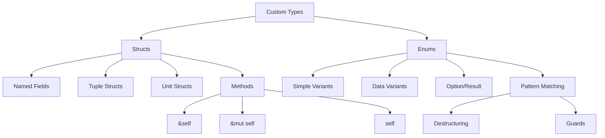

# 🏗️ Structs and Enums Overview

## 🎯 Пользовательские типы данных

Структуры и перечисления - основные строительные блоки для создания собственных типов в Rust.

## 📚 Содержание раздела

### 1. [[01_Core/05_Structs_Enums/01_Structs|Structures]]
- Обычные структуры
- Tuple structs
- Unit structs
- Методы и ассоциированные функции

### 2. [[01_Core/05_Structs_Enums/02_Enums|Enumerations]]
- Варианты enum
- Enum с данными
- Option и Result
- Pattern matching с enum

### 3. [[01_Core/05_Structs_Enums/03_Pattern_Matching|Pattern Matching]]
- match выражения
- Деструктуризация
- Guards и bindings
- Исчерпывающая проверка

### 4. [[01_Core/05_Structs_Enums/04_Option_Result|Option and Result]]
- Option<T> для опциональных значений
- Result<T, E> для обработки ошибок
- Комбинаторы
- Оператор ?

## 🏗️ Структуры

### Основные виды структур

```rust
// Обычная структура
struct User {
    username: String,
    email: String,
    active: bool,
}

// Tuple struct
struct Color(i32, i32, i32);
struct Point(f64, f64, f64);

// Unit struct
struct AlwaysEqual;
```

### Методы и impl блоки

```rust
impl User {
    // Ассоциированная функция (конструктор)
    fn new(username: String, email: String) -> Self {
        User {
            username,
            email,
            active: true,
        }
    }
    
    // Метод
    fn full_info(&self) -> String {
        format!("{} <{}>", self.username, self.email)
    }
    
    // Изменяющий метод
    fn deactivate(&mut self) {
        self.active = false;
    }
}
```

## 🎨 Перечисления

### Варианты enum

```rust
enum Message {
    Quit,                       // Unit variant
    Move { x: i32, y: i32 },   // Struct variant
    Write(String),              // Tuple variant
    ChangeColor(i32, i32, i32), // Multiple values
}

impl Message {
    fn call(&self) {
        match self {
            Message::Quit => println!("Quit"),
            Message::Move { x, y } => println!("Move to {}, {}", x, y),
            Message::Write(text) => println!("Write: {}", text),
            Message::ChangeColor(r, g, b) => {
                println!("Change color to RGB({}, {}, {})", r, g, b)
            }
        }
    }
}
```

## 🗺️ Концептуальная карта



## 💻 Практический пример

```rust
// Моделирование игровых сущностей
#[derive(Debug, Clone)]
struct Player {
    name: String,
    health: u32,
    position: Position,
    inventory: Vec<Item>,
}

#[derive(Debug, Clone, Copy)]
struct Position {
    x: f64,
    y: f64,
}

#[derive(Debug, Clone)]
enum Item {
    Weapon { damage: u32, durability: u32 },
    Potion { healing: u32 },
    Key { door_id: u32 },
}

impl Player {
    fn new(name: String) -> Self {
        Player {
            name,
            health: 100,
            position: Position { x: 0.0, y: 0.0 },
            inventory: Vec::new(),
        }
    }
    
    fn take_damage(&mut self, amount: u32) {
        self.health = self.health.saturating_sub(amount);
    }
    
    fn use_item(&mut self, index: usize) -> Option<String> {
        if let Some(item) = self.inventory.get(index) {
            match item {
                Item::Weapon { damage, .. } => {
                    Some(format!("Equipped weapon with {} damage", damage))
                }
                Item::Potion { healing } => {
                    self.health = (self.health + healing).min(100);
                    self.inventory.remove(index);
                    Some(format!("Healed for {} HP", healing))
                }
                Item::Key { door_id } => {
                    Some(format!("Can open door #{}", door_id))
                }
            }
        } else {
            None
        }
    }
}
```

## 🎯 Проверка понимания

- [ ] Могу создавать различные виды структур
- [ ] Понимаю разницу между методами и функциями
- [ ] Умею использовать enum с данными
- [ ] Владею pattern matching
- [ ] Знаю Option и Result

## ⚠️ Частые паттерны

### Builder Pattern
```rust
struct ConfigBuilder {
    setting1: Option<String>,
    setting2: Option<u32>,
}

impl ConfigBuilder {
    fn new() -> Self {
        ConfigBuilder {
            setting1: None,
            setting2: None,
        }
    }
    
    fn setting1(mut self, val: String) -> Self {
        self.setting1 = Some(val);
        self
    }
    
    fn build(self) -> Result<Config, String> {
        Ok(Config {
            setting1: self.setting1.ok_or("setting1 required")?,
            setting2: self.setting2.unwrap_or(42),
        })
    }
}
```

### Newtype Pattern
```rust
struct Meters(f64);
struct Seconds(f64);

impl Meters {
    fn to_feet(&self) -> f64 {
        self.0 * 3.28084
    }
}
```

## 📝 Упражнения

1. **Game Entity System**: Создайте систему игровых сущностей
2. **State Machine**: Реализуйте конечный автомат с enum
3. **Builder Pattern**: Создайте builder для сложной структуры
4. **JSON Parser**: Используйте enum для представления JSON

## 🔗 Следующие шаги

- [[01_Core/06_Traits/00_Index|Traits]] - поведение для типов
- [[01_Core/07_Generics/00_Index|Generics]] - обобщенные структуры
- [[02_Advanced/08_Patterns/00_Index|Design Patterns]] - паттерны проектирования

## 📚 Ресурсы

- [Rust Book Ch. 5](https://doc.rust-lang.org/book/ch05-00-structs.html)
- [Rust Book Ch. 6](https://doc.rust-lang.org/book/ch06-00-enums.html)
- [[Rust Cheatsheet|Quick Reference]]

---
#rust #structs #enums #types #core
