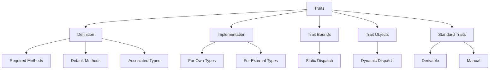

# 🔧 Traits Overview

## 🎯 Что такое Traits?

Traits определяют общее поведение, которое могут реализовать различные типы. Это похоже на интерфейсы в других языках, но с дополнительными возможностями.

## 📚 Содержание раздела

### 1. [[01_Core/06_Traits/01_Defining_Traits|Defining Traits]]
- Объявление trait
- Методы trait
- Ассоциированные типы и константы

### 2. [[01_Core/06_Traits/02_Implementing_Traits|Implementing Traits]]
- Реализация для типов
- Реализация по умолчанию
- Правило сироты (Orphan Rule)

### 3. [[01_Core/06_Traits/03_Trait_Bounds|Trait Bounds]]
- Ограничения в функциях
- where клаузы
- Multiple bounds

### 4. [[01_Core/06_Traits/04_Trait_Objects|Trait Objects]]
- Динамическая диспетчеризация
- dyn Trait
- Object safety

### 5. [[01_Core/06_Traits/05_Standard_Traits|Standard Library Traits]]
- Debug, Display
- Clone, Copy
- Iterator
- From, Into

## 🔧 Основы Traits

### Определение trait
```rust
trait Summary {
    // Обязательный метод
    fn summarize_author(&self) -> String;
    
    // Метод с реализацией по умолчанию
    fn summarize(&self) -> String {
        format!("(Read more from {}...)", self.summarize_author())
    }
}
```

### Реализация trait
```rust
struct Article {
    headline: String,
    author: String,
    content: String,
}

impl Summary for Article {
    fn summarize_author(&self) -> String {
        format!("@{}", self.author)
    }
    
    // Можем переопределить метод по умолчанию
    fn summarize(&self) -> String {
        format!("{}, by {}", self.headline, self.author)
    }
}
```

## 📊 Trait Bounds

### В функциях
```rust
// Краткая форма
fn notify(item: &impl Summary) {
    println!("Breaking news! {}", item.summarize());
}

// Полная форма
fn notify<T: Summary>(item: &T) {
    println!("Breaking news! {}", item.summarize());
}

// Множественные bounds
fn notify<T: Summary + Display>(item: &T) {
    println!("{}", item);
}

// where клауза для читаемости
fn some_function<T, U>(t: &T, u: &U) -> i32
where
    T: Display + Clone,
    U: Clone + Debug,
{
    // ...
}
```

### Возврат типов с traits
```rust
fn returns_summarizable() -> impl Summary {
    Article {
        headline: String::from("News"),
        author: String::from("Author"),
        content: String::from("Content"),
    }
}
```

## 🗺️ Концептуальная карта



## 💻 Практический пример

```rust
use std::fmt;

// Определяем trait для drawable объектов
trait Drawable {
    fn draw(&self);
    
    fn area(&self) -> f64;
    
    fn describe(&self) -> String {
        format!("Area: {:.2}", self.area())
    }
}

// Реализация для Circle
struct Circle {
    radius: f64,
}

impl Drawable for Circle {
    fn draw(&self) {
        println!("Drawing a circle with radius {}", self.radius);
    }
    
    fn area(&self) -> f64 {
        std::f64::consts::PI * self.radius * self.radius
    }
}

// Реализация для Rectangle
struct Rectangle {
    width: f64,
    height: f64,
}

impl Drawable for Rectangle {
    fn draw(&self) {
        println!("Drawing a {}x{} rectangle", self.width, self.height);
    }
    
    fn area(&self) -> f64 {
        self.width * self.height
    }
}

// Функция с trait bound
fn draw_and_describe<T: Drawable>(shape: &T) {
    shape.draw();
    println!("{}", shape.describe());
}

// Trait object для хранения разных типов
fn draw_all(shapes: &[Box<dyn Drawable>]) {
    for shape in shapes {
        shape.draw();
    }
}
```

## 🎨 Продвинутые концепции

### Associated Types
```rust
trait Container {
    type Item;
    
    fn contains(&self, item: &Self::Item) -> bool;
    fn first(&self) -> Option<&Self::Item>;
}

impl Container for Vec<i32> {
    type Item = i32;
    
    fn contains(&self, item: &i32) -> bool {
        self.iter().any(|x| x == item)
    }
    
    fn first(&self) -> Option<&i32> {
        self.first()
    }
}
```

### Supertraits
```rust
trait Person: fmt::Display {
    fn name(&self) -> String;
}

// Person требует Display
struct Student {
    name: String,
}

impl fmt::Display for Student {
    fn fmt(&self, f: &mut fmt::Formatter) -> fmt::Result {
        write!(f, "Student: {}", self.name)
    }
}

impl Person for Student {
    fn name(&self) -> String {
        self.name.clone()
    }
}
```

## 🎯 Важные стандартные traits

| Trait | Назначение | Пример |
|-------|------------|---------|
| `Debug` | Отладочный вывод | `{:?}` |
| `Display` | Пользовательский вывод | `{}` |
| `Clone` | Глубокое копирование | `.clone()` |
| `Copy` | Побитовое копирование | Автоматическое |
| `PartialEq` | Частичное равенство | `==`, `!=` |
| `Eq` | Полное равенство | HashMap ключи |
| `PartialOrd` | Частичный порядок | `<`, `>` |
| `Ord` | Полный порядок | `.sort()` |
| `Iterator` | Итерация | `for` циклы |

## 🎯 Проверка понимания

- [ ] Могу определять свои traits
- [ ] Понимаю trait bounds
- [ ] Знаю разницу между impl Trait и dyn Trait
- [ ] Умею использовать where клаузы
- [ ] Знаком со стандартными traits

## ⚠️ Частые ошибки

### Ошибка: Orphan Rule
```rust
// ❌ ОШИБКА: нельзя реализовать внешний trait для внешнего типа
impl fmt::Display for Vec<i32> {
    // ...
}

// ✅ Решение: newtype pattern
struct MyVec(Vec<i32>);

impl fmt::Display for MyVec {
    fn fmt(&self, f: &mut fmt::Formatter) -> fmt::Result {
        write!(f, "{:?}", self.0)
    }
}
```

### Ошибка: Object Safety
```rust
// ❌ Trait не object-safe из-за generics
trait NotObjectSafe {
    fn generic<T>(&self, x: T);
}

// ✅ Object-safe trait
trait ObjectSafe {
    fn method(&self);
}
```

## 📝 Упражнения

1. **Custom Iterator**: Создайте свой итератор
2. **Trait Hierarchy**: Реализуйте иерархию traits
3. **Generic Functions**: Напишите функции с trait bounds
4. **Trait Objects**: Используйте динамическую диспетчеризацию

## 🔗 Следующие шаги

- [[01_Core/07_Generics/00_Index|Generics]] - обобщенное программирование
- [[02_Advanced/07_Type_System/00_Index|Advanced Type System]] - продвинутые типы
- [[02_Advanced/02_Async/03_Async_Traits|Async Traits]] - асинхронные traits

## 📚 Ресурсы

- [Rust Book Ch. 10](https://doc.rust-lang.org/book/ch10-00-generics.html)
- [Rust by Example - Traits](https://doc.rust-lang.org/rust-by-example/trait.html)
- [[Common Errors|Trait Errors]]

---
#rust #traits #interfaces #core
