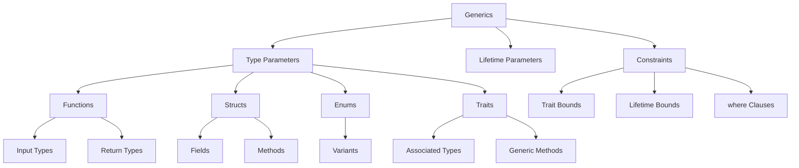

# 🧬 Generics Overview

## 🎯 Обобщенное программирование в Rust

Generics позволяют писать код, работающий с различными типами, избегая дублирования и сохраняя типобезопасность.

## 📚 Содержание раздела

### 1. [[01_Core/07_Generics/01_Generic_Functions|Generic Functions]]
- Параметры типов
- Обобщенные функции
- Type inference

### 2. [[01_Core/07_Generics/02_Generic_Structs|Generic Structs]]
- Структуры с параметрами типов
- Методы для обобщенных структур
- Multiple type parameters

### 3. [[01_Core/07_Generics/03_Generic_Enums|Generic Enums]]
- Option<T>
- Result<T, E>
- Создание своих generic enums

### 4. [[01_Core/07_Generics/04_Generic_Constraints|Generic Constraints]]
- Trait bounds
- where клаузы
- Associated types

## 🧬 Основы Generics

### Generic функции
```rust
// Простая generic функция
fn largest<T: PartialOrd>(list: &[T]) -> &T {
    let mut largest = &list[0];
    
    for item in list {
        if item > largest {
            largest = item;
        }
    }
    
    largest
}

// Множественные параметры типов
fn swap<T, U>(x: T, y: U) -> (U, T) {
    (y, x)
}
```

### Generic структуры
```rust
// Структура с одним типом
struct Point<T> {
    x: T,
    y: T,
}

// Структура с разными типами
struct Pair<T, U> {
    first: T,
    second: U,
}

impl<T> Point<T> {
    fn x(&self) -> &T {
        &self.x
    }
}

// Методы только для конкретных типов
impl Point<f32> {
    fn distance_from_origin(&self) -> f32 {
        (self.x.powi(2) + self.y.powi(2)).sqrt()
    }
}
```

### Generic enums
```rust
enum Option<T> {
    Some(T),
    None,
}

enum Result<T, E> {
    Ok(T),
    Err(E),
}

// Собственный generic enum
enum BinaryTree<T> {
    Empty,
    Node {
        value: T,
        left: Box<BinaryTree<T>>,
        right: Box<BinaryTree<T>>,
    },
}
```

## 📊 Trait Bounds и Constraints

### Базовые ограничения
```rust
// Одно ограничение
fn print_it<T: Display>(item: T) {
    println!("{}", item);
}

// Множественные ограничения
fn compare_and_display<T: Display + PartialOrd>(item: T) {
    println!("{}", item);
}

// where клауза для читаемости
fn some_function<T, U>(t: &T, u: &U) -> String
where
    T: Display + Clone,
    U: Clone + Debug,
{
    format!("{}", t)
}
```

### Lifetime bounds
```rust
struct Ref<'a, T: 'a>(&'a T);

// T должен жить как минимум столько же, сколько 'a
fn longest_with_announcement<'a, T>(
    x: &'a str,
    y: &'a str,
    ann: T,
) -> &'a str
where
    T: Display,
{
    println!("Announcement! {}", ann);
    if x.len() > y.len() { x } else { y }
}
```

## 🗺️ Концептуальная карта



## 💻 Практический пример

```rust
use std::cmp::Ordering;
use std::fmt::Display;

// Generic контейнер с ограничениями
#[derive(Debug)]
struct SortedVec<T> 
where 
    T: Ord + Clone,
{
    data: Vec<T>,
}

impl<T> SortedVec<T> 
where 
    T: Ord + Clone,
{
    fn new() -> Self {
        SortedVec { data: Vec::new() }
    }
    
    fn insert(&mut self, value: T) {
        match self.data.binary_search(&value) {
            Ok(pos) | Err(pos) => self.data.insert(pos, value),
        }
    }
    
    fn contains(&self, value: &T) -> bool {
        self.data.binary_search(value).is_ok()
    }
    
    fn merge<U>(self, other: SortedVec<U>) -> SortedVec<T>
    where
        U: Into<T>,
    {
        let mut result = self;
        for item in other.data {
            result.insert(item.into());
        }
        result
    }
}

// Generic trait
trait Container<T> {
    fn add(&mut self, item: T);
    fn is_empty(&self) -> bool;
    fn clear(&mut self);
}

impl<T: Ord + Clone> Container<T> for SortedVec<T> {
    fn add(&mut self, item: T) {
        self.insert(item);
    }
    
    fn is_empty(&self) -> bool {
        self.data.is_empty()
    }
    
    fn clear(&mut self) {
        self.data.clear();
    }
}
```

## 🎨 Продвинутые паттерны

### Phantom Types
```rust
use std::marker::PhantomData;

struct Locked;
struct Unlocked;

struct Door<State> {
    _marker: PhantomData<State>,
}

impl Door<Locked> {
    fn unlock(self) -> Door<Unlocked> {
        Door { _marker: PhantomData }
    }
}

impl Door<Unlocked> {
    fn lock(self) -> Door<Locked> {
        Door { _marker: PhantomData }
    }
    
    fn open(&self) {
        println!("Door is open!");
    }
}
```

### Const Generics
```rust
struct Array<T, const N: usize> {
    data: [T; N],
}

impl<T: Default + Copy, const N: usize> Array<T, N> {
    fn new() -> Self {
        Array {
            data: [T::default(); N],
        }
    }
}

// Использование
let arr: Array<i32, 5> = Array::new();
```

## 🎯 Проверка понимания

- [ ] Понимаю параметры типов
- [ ] Могу писать generic функции
- [ ] Умею создавать generic структуры
- [ ] Знаю trait bounds
- [ ] Понимаю мономорфизацию

## ⚠️ Производительность

### Мономорфизация
```rust
// Этот generic код
fn generic<T>(x: T) -> T {
    x
}

let integer = generic(5);
let float = generic(5.0);

// Компилируется в:
fn generic_i32(x: i32) -> i32 { x }
fn generic_f64(x: f64) -> f64 { x }
```

**Плюсы**: Нет накладных расходов во время выполнения
**Минусы**: Увеличение размера бинарника

## 📝 Упражнения

1. **Generic Stack**: Реализуйте обобщенный стек
2. **Binary Tree**: Создайте generic дерево
3. **Matrix Operations**: Generic матричные операции
4. **Type State Pattern**: Используйте phantom types

## 🔗 Следующие шаги

- [[01_Core/06_Traits/00_Index|Traits]] - ограничения для generics
- [[02_Advanced/07_Type_System/02_GATs|Generic Associated Types]] - GATs
- [[01_Core/04_Lifetimes/00_Index|Lifetimes]] - generic lifetimes

## 📚 Ресурсы

- [Rust Book Ch. 10](https://doc.rust-lang.org/book/ch10-01-syntax.html)
- [Rust by Example - Generics](https://doc.rust-lang.org/rust-by-example/generics.html)
- [[Common Errors|Generic Errors]]

---
#rust #generics #types #core
