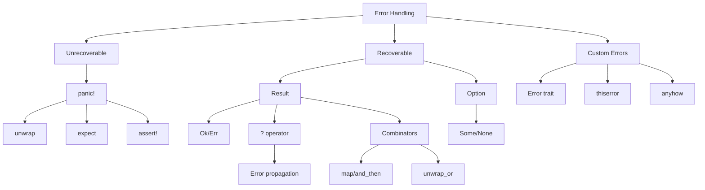

# ⚠️ Error Handling Overview

## 🎯 Обработка ошибок в Rust

Rust использует типы Result и Option для явной обработки ошибок, делая программы более надежными и предсказуемыми.

## 📚 Содержание раздела

### 1. [[01_Core/08_Error_Handling/01_Panic|Panic!]]
- Невосстановимые ошибки
- panic! макрос
- RUST_BACKTRACE

### 2. [[01_Core/08_Error_Handling/02_Result_Type|Result Type]]
- Result<T, E>
- Обработка Ok и Err
- Комбинаторы Result

### 3. [[01_Core/08_Error_Handling/03_Error_Propagation|Error Propagation]]
- Оператор ?
- Преобразование ошибок
- From trait для ошибок

### 4. [[01_Core/08_Error_Handling/04_Custom_Errors|Custom Errors]]
- Создание своих типов ошибок
- Error trait
- thiserror и anyhow

## 🚨 Два вида ошибок

### Невосстановимые ошибки - panic!
```rust
// Явная паника
panic!("crash and burn");

// Паника при выходе за границы
let v = vec![1, 2, 3];
v[99]; // panic!

// unwrap и expect
let f = File::open("hello.txt").unwrap(); // panic если файла нет
let f = File::open("hello.txt").expect("Failed to open hello.txt");
```

### Восстановимые ошибки - Result
```rust
use std::fs::File;
use std::io::ErrorKind;

fn main() {
    let f = File::open("hello.txt");
    
    let f = match f {
        Ok(file) => file,
        Err(error) => match error.kind() {
            ErrorKind::NotFound => match File::create("hello.txt") {
                Ok(fc) => fc,
                Err(e) => panic!("Problem creating file: {:?}", e),
            },
            other_error => {
                panic!("Problem opening file: {:?}", other_error)
            }
        },
    };
}
```

## 🎯 Оператор ? для распространения ошибок

```rust
use std::fs::File;
use std::io::{self, Read};

fn read_username_from_file() -> Result<String, io::Error> {
    let mut f = File::open("hello.txt")?;
    let mut s = String::new();
    f.read_to_string(&mut s)?;
    Ok(s)
}

// Еще короче
fn read_username_from_file_short() -> Result<String, io::Error> {
    let mut s = String::new();
    File::open("hello.txt")?.read_to_string(&mut s)?;
    Ok(s)
}

// Самый короткий вариант
fn read_username_from_file_shortest() -> Result<String, io::Error> {
    std::fs::read_to_string("hello.txt")
}
```

## 📊 Комбинаторы для работы с Result и Option

### Result методы
```rust
let result: Result<i32, &str> = Ok(2);

// map - преобразование Ok значения
let mapped = result.map(|x| x * 2); // Ok(4)

// map_err - преобразование ошибки
let result: Result<i32, &str> = Err("error");
let mapped = result.map_err(|e| format!("Error: {}", e));

// and_then - цепочка операций
let result = Ok(2)
    .and_then(|x| Ok(x * 2))
    .and_then(|x| Ok(x + 1)); // Ok(5)

// unwrap_or - значение по умолчанию
let value = result.unwrap_or(0);

// unwrap_or_else - вычисляемое значение по умолчанию
let value = result.unwrap_or_else(|e| {
    println!("Error: {}", e);
    0
});
```

### Option методы
```rust
let option: Option<i32> = Some(5);

// map
let mapped = option.map(|x| x * 2); // Some(10)

// filter
let filtered = option.filter(|&x| x > 3); // Some(5)

// and_then (flatMap)
let result = option.and_then(|x| {
    if x > 0 { Some(x) } else { None }
});

// or_else
let result = None.or_else(|| Some(5)); // Some(5)

// ok_or - конвертация в Result
let result = option.ok_or("No value"); // Ok(5)
```

## 🗺️ Концептуальная карта



## 💻 Практический пример

```rust
use std::fs::File;
use std::io::{self, Read, Write};
use std::error::Error;
use std::fmt;

// Пользовательский тип ошибки
#[derive(Debug)]
enum ConfigError {
    Io(io::Error),
    Parse(std::num::ParseIntError),
    Validation(String),
}

impl fmt::Display for ConfigError {
    fn fmt(&self, f: &mut fmt::Formatter) -> fmt::Result {
        match self {
            ConfigError::Io(e) => write!(f, "IO error: {}", e),
            ConfigError::Parse(e) => write!(f, "Parse error: {}", e),
            ConfigError::Validation(s) => write!(f, "Validation error: {}", s),
        }
    }
}

impl Error for ConfigError {}

// Автоматическое преобразование ошибок
impl From<io::Error> for ConfigError {
    fn from(error: io::Error) -> Self {
        ConfigError::Io(error)
    }
}

impl From<std::num::ParseIntError> for ConfigError {
    fn from(error: std::num::ParseIntError) -> Self {
        ConfigError::Parse(error)
    }
}

// Функция с обработкой ошибок
fn load_config(path: &str) -> Result<Config, ConfigError> {
    let mut file = File::open(path)?;
    let mut contents = String::new();
    file.read_to_string(&mut contents)?;
    
    let lines: Vec<&str> = contents.lines().collect();
    if lines.len() < 2 {
        return Err(ConfigError::Validation(
            "Config file must have at least 2 lines".to_string()
        ));
    }
    
    let port: u16 = lines[0].parse()?;
    let host = lines[1].to_string();
    
    if port == 0 {
        return Err(ConfigError::Validation(
            "Port cannot be 0".to_string()
        ));
    }
    
    Ok(Config { host, port })
}

struct Config {
    host: String,
    port: u16,
}

// Использование
fn main() -> Result<(), Box<dyn Error>> {
    let config = load_config("config.txt")?;
    println!("Server: {}:{}", config.host, config.port);
    Ok(())
}
```

## 🎨 Библиотеки для обработки ошибок

### thiserror - для библиотек
```rust
use thiserror::Error;

#[derive(Error, Debug)]
enum DataError {
    #[error("data not found")]
    NotFound,
    
    #[error("invalid header (expected {expected:?}, found {found:?})")]
    InvalidHeader {
        expected: String,
        found: String,
    },
    
    #[error("io error")]
    Io(#[from] std::io::Error),
}
```

### anyhow - для приложений
```rust
use anyhow::{Context, Result};

fn get_config() -> Result<Config> {
    let path = "config.toml";
    let config = std::fs::read_to_string(path)
        .with_context(|| format!("Failed to read {}", path))?;
    
    let config: Config = toml::from_str(&config)
        .context("Failed to parse config")?;
    
    Ok(config)
}
```

## 🎯 Проверка понимания

- [ ] Знаю когда использовать panic! vs Result
- [ ] Понимаю оператор ?
- [ ] Умею создавать custom errors
- [ ] Знаю комбинаторы Result/Option
- [ ] Понимаю Error trait

## ⚠️ Best Practices

1. **Используйте Result для ожидаемых ошибок**
2. **panic! только для багов и невозможных состояний**
3. **Предоставляйте контекст ошибок**
4. **Используйте ? для propagation**
5. **thiserror для библиотек, anyhow для приложений**

## 📝 Упражнения

1. **Config Parser**: Парсер конфигурации с обработкой ошибок
2. **File Processor**: Обработчик файлов с детальными ошибками
3. **Network Client**: HTTP клиент с retry логикой
4. **Custom Error Types**: Иерархия ошибок для приложения

## 🔗 Следующие шаги

- [[02_Advanced/02_Async/05_Error_Handling|Async Error Handling]] - ошибки в async
- [[01_Core/06_Traits/05_Standard_Traits|Error Trait]] - стандартный trait
- [[03_Projects/00_Index|Projects]] - практика обработки ошибок

## 📚 Ресурсы

- [Rust Book Ch. 9](https://doc.rust-lang.org/book/ch09-00-error-handling.html)
- [Error Handling Survey](https://blog.burntsushi.net/rust-error-handling/)
- [[Common Errors|Common Error Patterns]]

---
#rust #errors #result #option #panic #core
