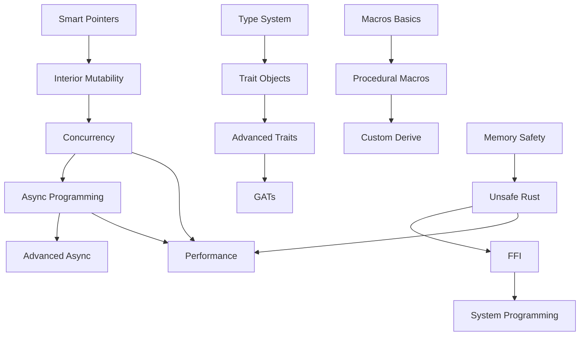

# 🔹 Advanced Topics Index

## 🚀 Продвинутые концепции Rust

### 1. [[02_Advanced/01_Concurrency/00_Index|🔄 Concurrency & Parallelism]]
#### Многопоточность
- [[02_Advanced/01_Concurrency/01_Threads|Потоки (Threads)]]
- [[02_Advanced/01_Concurrency/02_Message_Passing|Message Passing (channels)]]
- [[02_Advanced/01_Concurrency/03_Shared_State|Shared State (Mutex, Arc)]]
- [[02_Advanced/01_Concurrency/04_Sync_Send|Sync и Send трейты]]
- [[02_Advanced/01_Concurrency/05_Rayon|Параллелизм с Rayon]]

### 2. [[02_Advanced/02_Async/00_Index|⚡ Async Programming]]
#### Асинхронное программирование
- [[02_Advanced/02_Async/01_Futures|Futures и async/await]]
- [[02_Advanced/02_Async/02_Tokio|Tokio runtime]]
- [[02_Advanced/02_Async/03_Async_Traits|Async traits]]
- [[02_Advanced/02_Async/04_Streams|Async streams]]
- [[02_Advanced/02_Async/05_Error_Handling|Error handling в async]]

### 3. [[02_Advanced/03_Smart_Pointers/00_Index|🧠 Smart Pointers]]
#### Умные указатели
- [[02_Advanced/03_Smart_Pointers/01_Box|Box<T> - heap allocation]]
- [[02_Advanced/03_Smart_Pointers/02_Rc|Rc<T> - reference counting]]
- [[02_Advanced/03_Smart_Pointers/03_Arc|Arc<T> - atomic RC]]
- [[02_Advanced/03_Smart_Pointers/04_RefCell|RefCell<T> - interior mutability]]
- [[02_Advanced/03_Smart_Pointers/05_Weak|Weak<T> - weak references]]
- [[02_Advanced/03_Smart_Pointers/06_Cow|Cow<T> - clone on write]]

### 4. [[02_Advanced/04_Macros/00_Index|🔮 Macros]]
#### Макросы
- [[02_Advanced/04_Macros/01_Declarative|Декларативные макросы (macro_rules!)]]
- [[02_Advanced/04_Macros/02_Procedural|Процедурные макросы]]
- [[02_Advanced/04_Macros/03_Derive|Derive макросы]]
- [[02_Advanced/04_Macros/04_Attribute|Attribute макросы]]
- [[02_Advanced/04_Macros/05_Function_Like|Function-like макросы]]

### 5. [[02_Advanced/05_Unsafe/00_Index|⚠️ Unsafe Rust]]
#### Небезопасный код
- [[02_Advanced/05_Unsafe/01_Raw_Pointers|Сырые указатели]]
- [[02_Advanced/05_Unsafe/02_Unsafe_Functions|Unsafe функции]]
- [[02_Advanced/05_Unsafe/03_Unsafe_Traits|Unsafe трейты]]
- [[02_Advanced/05_Unsafe/04_FFI|Foreign Function Interface]]
- [[02_Advanced/05_Unsafe/05_Inline_Assembly|Inline assembly]]

### 6. [[02_Advanced/06_Performance/00_Index|🏎️ Performance]]
#### Оптимизация производительности
- [[02_Advanced/06_Performance/01_Profiling|Профилирование]]
- [[02_Advanced/06_Performance/02_Benchmarking|Бенчмаркинг]]
- [[02_Advanced/06_Performance/03_Memory_Layout|Memory layout]]
- [[02_Advanced/06_Performance/04_SIMD|SIMD оптимизации]]
- [[02_Advanced/06_Performance/05_Compiler_Optimizations|Оптимизации компилятора]]

### 7. [[02_Advanced/07_Type_System/00_Index|🎭 Advanced Type System]]
#### Продвинутая система типов
- [[02_Advanced/07_Type_System/01_Associated_Types|Associated types]]
- [[02_Advanced/07_Type_System/02_GATs|Generic Associated Types]]
- [[02_Advanced/07_Type_System/03_HKT|Higher-Kinded Types]]
- [[02_Advanced/07_Type_System/04_Phantom_Types|Phantom types]]
- [[02_Advanced/07_Type_System/05_Type_State|Type state pattern]]

### 8. [[02_Advanced/08_Patterns/00_Index|🎨 Design Patterns]]
#### Паттерны проектирования
- [[02_Advanced/08_Patterns/01_Builder|Builder pattern]]
- [[02_Advanced/08_Patterns/02_Factory|Factory pattern]]
- [[02_Advanced/08_Patterns/03_Observer|Observer pattern]]
- [[02_Advanced/08_Patterns/04_Strategy|Strategy pattern]]
- [[02_Advanced/08_Patterns/05_RAII|RAII pattern]]
- [[02_Advanced/08_Patterns/06_Newtype|Newtype pattern]]

## 🗺️ Roadmap продвинутых тем

## 📊 Сложность и время изучения

| Тема | Сложность | Время изучения | Предварительные знания |
|------|-----------|----------------|------------------------|
| Smart Pointers | ⭐⭐⭐ | 10-15 часов | Ownership, References |
| Concurrency | ⭐⭐⭐⭐ | 15-20 часов | Smart Pointers, Traits |
| Async Programming | ⭐⭐⭐⭐ | 20-25 часов | Concurrency, Futures |
| Macros | ⭐⭐⭐⭐ | 15-20 часов | Syntax, Patterns |
| Unsafe Rust | ⭐⭐⭐⭐⭐ | 20-30 часов | Все основы |
| Performance | ⭐⭐⭐⭐ | 15-20 часов | Профилирование |
| Type System | ⭐⭐⭐⭐⭐ | 25-30 часов | Traits, Generics |
| Design Patterns | ⭐⭐⭐ | 10-15 часов | OOP концепции |

## 🎯 Практические задания

### Concurrency Challenge
Реализовать thread pool с work stealing:
- [ ] Базовый thread pool
- [ ] Work stealing queue
- [ ] Балансировка нагрузки
- [ ] Graceful shutdown

### Async Challenge
Создать async web crawler:
- [ ] Concurrent fetching
- [ ] Rate limiting
- [ ] Error recovery
- [ ] Progress tracking

### Macro Challenge
Написать макрос для автоматической генерации builder pattern:
- [ ] Базовый builder
- [ ] Optional fields
- [ ] Validation
- [ ] Compile-time checks

### Unsafe Challenge
Реализовать lock-free структуру данных:
- [ ] Lock-free stack
- [ ] Memory ordering
- [ ] ABA problem solution
- [ ] Benchmarks

## 📚 Рекомендуемая литература

### Книги
- 📖 "Rust for Rustaceans" - Jon Gjengset
- 📖 "Programming Rust" - Blandy & Orendorff
- 📖 "Rust in Action" - Tim McNamara
- 📖 "Zero To Production In Rust" - Luca Palmieri

### Онлайн ресурсы
- 🔗 [Rust Async Book](https://rust-lang.github.io/async-book/)
- 🔗 [The Rustonomicon](https://doc.rust-lang.org/nomicon/)
- 🔗 [Rust Performance Book](https://nnethercote.github.io/perf-book/)
- 🔗 [Too Many Linked Lists](https://rust-unofficial.github.io/too-many-lists/)

### Видео курсы
- 🎥 Jon Gjengset's YouTube channel
- 🎥 Ryan Levick's Rust streams
- 🎥 FasterthanlI.me videos

## 🔧 Инструменты для изучения

- **miri** - интерпретатор для поиска undefined behavior
- **cargo-expand** - раскрытие макросов
- **cargo-asm** - просмотр ассемблера
- **valgrind** - поиск утечек памяти
- **perf** - профилирование производительности

---
#rust #advanced #concurrency #async #macros #unsafe
