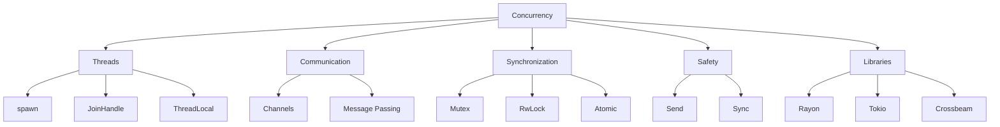

# 🔄 Concurrency & Parallelism Overview

## 🎯 Многопоточность в Rust

Rust обеспечивает безопасную многопоточность через систему владения, предотвращая data races на этапе компиляции.

## 📚 Содержание раздела

### 1. [[02_Advanced/01_Concurrency/01_Threads|Threads]]
- Создание потоков
- JoinHandle
- move замыкания

### 2. [[02_Advanced/01_Concurrency/02_Message_Passing|Message Passing]]
- Каналы (channels)
- mpsc (multi-producer, single-consumer)
- Отправка значений между потоками

### 3. [[02_Advanced/01_Concurrency/03_Shared_State|Shared State]]
- Mutex<T>
- Arc<T>
- RwLock<T>

### 4. [[02_Advanced/01_Concurrency/04_Sync_Send|Sync and Send Traits]]
- Send - безопасная передача между потоками
- Sync - безопасный доступ из нескольких потоков
- Маркерные traits

### 5. [[02_Advanced/01_Concurrency/05_Rayon|Parallel Processing with Rayon]]
- Data parallelism
- Parallel iterators
- Thread pools

## 🧵 Создание потоков

```rust
use std::thread;
use std::time::Duration;

fn main() {
    // Простой поток
    let handle = thread::spawn(|| {
        for i in 1..10 {
            println!("hi number {} from spawned thread!", i);
            thread::sleep(Duration::from_millis(1));
        }
    });
    
    // Главный поток
    for i in 1..5 {
        println!("hi number {} from main thread!", i);
        thread::sleep(Duration::from_millis(1));
    }
    
    // Ждем завершения потока
    handle.join().unwrap();
}
```

### Move семантика в потоках
```rust
let v = vec![1, 2, 3];

let handle = thread::spawn(move || {
    println!("Here's a vector: {:?}", v);
});

handle.join().unwrap();
// v больше не доступен в main
```

## 📬 Message Passing

```rust
use std::sync::mpsc;
use std::thread;

fn main() {
    let (tx, rx) = mpsc::channel();
    
    // Клонируем передатчик для нескольких потоков
    let tx1 = tx.clone();
    
    thread::spawn(move || {
        let vals = vec![
            String::from("hi"),
            String::from("from"),
            String::from("thread"),
        ];
        
        for val in vals {
            tx1.send(val).unwrap();
            thread::sleep(Duration::from_secs(1));
        }
    });
    
    thread::spawn(move || {
        let vals = vec![
            String::from("more"),
            String::from("messages"),
        ];
        
        for val in vals {
            tx.send(val).unwrap();
            thread::sleep(Duration::from_secs(1));
        }
    });
    
    // Получаем сообщения
    for received in rx {
        println!("Got: {}", received);
    }
}
```

## 🔒 Shared State с Mutex

```rust
use std::sync::{Arc, Mutex};
use std::thread;

fn main() {
    let counter = Arc::new(Mutex::new(0));
    let mut handles = vec![];
    
    for _ in 0..10 {
        let counter = Arc::clone(&counter);
        let handle = thread::spawn(move || {
            let mut num = counter.lock().unwrap();
            *num += 1;
        });
        handles.push(handle);
    }
    
    for handle in handles {
        handle.join().unwrap();
    }
    
    println!("Result: {}", *counter.lock().unwrap());
}
```

## 🗺️ Концептуальная карта



## 💻 Практический пример: Thread Pool

```rust
use std::sync::{Arc, Mutex, mpsc};
use std::thread;

pub struct ThreadPool {
    workers: Vec<Worker>,
    sender: mpsc::Sender<Message>,
}

type Job = Box<dyn FnOnce() + Send + 'static>;

enum Message {
    NewJob(Job),
    Terminate,
}

impl ThreadPool {
    pub fn new(size: usize) -> ThreadPool {
        assert!(size > 0);
        
        let (sender, receiver) = mpsc::channel();
        let receiver = Arc::new(Mutex::new(receiver));
        
        let mut workers = Vec::with_capacity(size);
        
        for id in 0..size {
            workers.push(Worker::new(id, Arc::clone(&receiver)));
        }
        
        ThreadPool { workers, sender }
    }
    
    pub fn execute<F>(&self, f: F)
    where
        F: FnOnce() + Send + 'static,
    {
        let job = Box::new(f);
        self.sender.send(Message::NewJob(job)).unwrap();
    }
}

impl Drop for ThreadPool {
    fn drop(&mut self) {
        println!("Sending terminate message to all workers.");
        
        for _ in &self.workers {
            self.sender.send(Message::Terminate).unwrap();
        }
        
        println!("Shutting down all workers.");
        
        for worker in &mut self.workers {
            println!("Shutting down worker {}", worker.id);
            
            if let Some(thread) = worker.thread.take() {
                thread.join().unwrap();
            }
        }
    }
}

struct Worker {
    id: usize,
    thread: Option<thread::JoinHandle<()>>,
}

impl Worker {
    fn new(id: usize, receiver: Arc<Mutex<mpsc::Receiver<Message>>>) -> Worker {
        let thread = thread::spawn(move || loop {
            let message = receiver.lock().unwrap().recv().unwrap();
            
            match message {
                Message::NewJob(job) => {
                    println!("Worker {} got a job; executing.", id);
                    job();
                }
                Message::Terminate => {
                    println!("Worker {} was told to terminate.", id);
                    break;
                }
            }
        });
        
        Worker {
            id,
            thread: Some(thread),
        }
    }
}
```

## 🎯 Send и Sync Traits

```rust
// Send: тип можно безопасно передавать между потоками
// Почти все типы Send, кроме Rc<T>

// Sync: на тип можно безопасно ссылаться из нескольких потоков
// T is Sync если &T is Send

// Примеры:
// - i32 is Send and Sync
// - Vec<T> is Send если T is Send
// - Arc<T> is Send and Sync если T is Send and Sync
// - Rc<T> is neither Send nor Sync
// - RefCell<T> is Send но не Sync
// - Mutex<T> is Send and Sync если T is Send
```

## ⚡ Rayon для параллелизма данных

```rust
use rayon::prelude::*;

fn main() {
    let mut vec = vec![1, 2, 3, 4, 5, 6, 7, 8, 9, 10];
    
    // Параллельная сортировка
    vec.par_sort();
    
    // Параллельный итератор
    let sum: i32 = vec.par_iter()
        .map(|&x| x * x)
        .sum();
    
    println!("Sum of squares: {}", sum);
    
    // Параллельный поиск
    let result = vec.par_iter()
        .find_any(|&&x| x > 5);
    
    println!("Found: {:?}", result);
}
```

## 🎯 Проверка понимания

- [ ] Могу создавать и управлять потоками
- [ ] Понимаю channels и message passing
- [ ] Умею использовать Mutex и Arc
- [ ] Знаю Send и Sync traits
- [ ] Могу использовать Rayon

## ⚠️ Частые проблемы

### Deadlock
```rust
// ❌ Потенциальный deadlock
let lock1 = mutex1.lock().unwrap();
let lock2 = mutex2.lock().unwrap(); // Другой поток может захватить в обратном порядке

// ✅ Решение: всегда захватывать в одном порядке
```

### Data Race Prevention
```rust
// ❌ Не компилируется - Rust предотвращает data race
let mut data = vec![1, 2, 3];
let handle = thread::spawn(|| {
    data.push(4); // ОШИБКА: data не Send
});

// ✅ Используем Arc<Mutex<T>>
let data = Arc::new(Mutex::new(vec![1, 2, 3]));
```

## 📝 Упражнения

1. **Producer-Consumer**: Реализуйте паттерн с channels
2. **Parallel Merge Sort**: Параллельная сортировка слиянием
3. **Web Scraper**: Многопоточный веб-скрапер
4. **Chat Server**: Сервер с обработкой клиентов в потоках

## 🔗 Следующие шаги

- [[02_Advanced/02_Async/00_Index|Async Programming]] - асинхронность
- [[02_Advanced/03_Smart_Pointers/00_Index|Smart Pointers]] - Arc, Mutex
- [[02_Advanced/06_Performance/00_Index|Performance]] - оптимизация

## 📚 Ресурсы

- [Rust Book Ch. 16](https://doc.rust-lang.org/book/ch16-00-concurrency.html)
- [Rayon Documentation](https://docs.rs/rayon/)
- [[Common Errors|Concurrency Errors]]

---
#rust #concurrency #threads #parallelism #advanced
