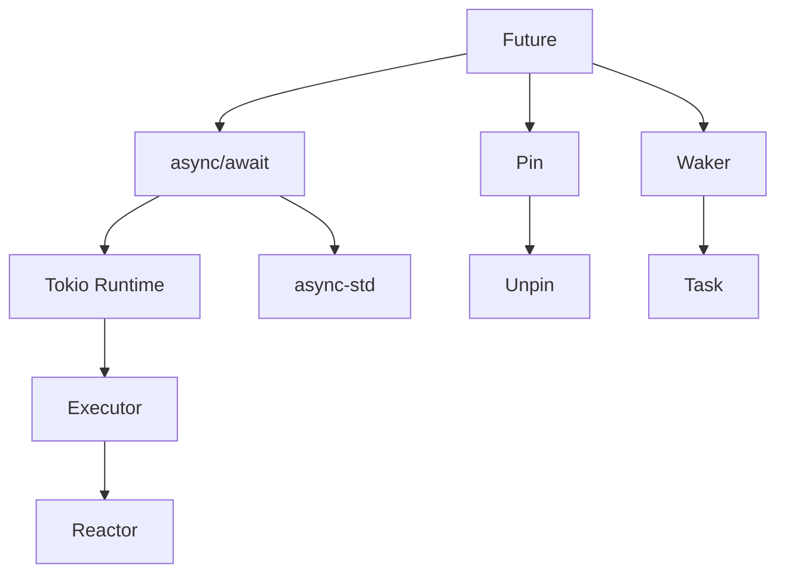

# ⚡ Futures and async/await

## 📋 Основы асинхронного программирования

### Что такое Future?

**Future** - это значение, которое может быть еще не готово. Это трейт, представляющий асинхронное вычисление.

```rust
pub trait Future {
    type Output;
    
    fn poll(self: Pin<&mut Self>, cx: &mut Context<'_>) -> Poll<Self::Output>;
}

pub enum Poll<T> {
    Ready(T),
    Pending,
}
```

## 🔗 Связанные концепции



- [[02_Advanced/02_Async/02_Tokio|Tokio]] - популярный async runtime
- [[02_Advanced/02_Async/03_Async_Traits|Async Traits]] - трейты с async методами
- [[02_Advanced/03_Smart_Pointers/00_Index|Pin]] - закрепление в памяти
- [[02_Advanced/01_Concurrency/00_Index|Concurrency]] - параллелизм vs конкурентность

## 💻 Базовые примеры

### Простая async функция
```rust
async fn hello_world() -> String {
    "Hello, World!".to_string()
}

// Эквивалентно:
fn hello_world() -> impl Future<Output = String> {
    async {
        "Hello, World!".to_string()
    }
}
```

### Использование await
```rust
async fn fetch_data() -> Result<String, Error> {
    let response = reqwest::get("https://api.example.com/data")
        .await?;  // Ожидаем завершения запроса
    
    let text = response.text().await?;  // Ожидаем получения текста
    
    Ok(text)
}
```

### Параллельное выполнение
```rust
use futures::future::join;

async fn parallel_tasks() {
    let future1 = async_task_1();
    let future2 = async_task_2();
    
    // Выполняются параллельно
    let (result1, result2) = join(future1, future2).await;
}
```

## 🎯 Продвинутые концепции

### Pin и Unpin
```rust
use std::pin::Pin;
use std::future::Future;

// Future, который нельзя перемещать после начала выполнения
struct MyFuture {
    // self-referential структура
    data: String,
    ptr: *const String,
}

impl Future for MyFuture {
    type Output = ();
    
    fn poll(self: Pin<&mut Self>, cx: &mut Context<'_>) -> Poll<Self::Output> {
        // Безопасная работа с закрепленными данными
        Poll::Ready(())
    }
}
```

### Создание собственного Future
```rust
use std::task::{Context, Poll, Waker};
use std::sync::{Arc, Mutex};
use std::time::Duration;
use std::thread;

struct TimerFuture {
    shared_state: Arc<Mutex<SharedState>>,
}

struct SharedState {
    completed: bool,
    waker: Option<Waker>,
}

impl Future for TimerFuture {
    type Output = ();
    
    fn poll(self: Pin<&mut Self>, cx: &mut Context<'_>) -> Poll<Self::Output> {
        let mut shared_state = self.shared_state.lock().unwrap();
        
        if shared_state.completed {
            Poll::Ready(())
        } else {
            shared_state.waker = Some(cx.waker().clone());
            Poll::Pending
        }
    }
}

impl TimerFuture {
    fn new(duration: Duration) -> Self {
        let shared_state = Arc::new(Mutex::new(SharedState {
            completed: false,
            waker: None,
        }));
        
        let thread_shared_state = shared_state.clone();
        thread::spawn(move || {
            thread::sleep(duration);
            let mut shared_state = thread_shared_state.lock().unwrap();
            shared_state.completed = true;
            if let Some(waker) = shared_state.waker.take() {
                waker.wake();
            }
        });
        
        TimerFuture { shared_state }
    }
}
```

### Select - выбор первого готового Future
```rust
use futures::select;
use futures::future::FutureExt;

async fn race_futures() {
    let mut future1 = async_task_1().fuse();
    let mut future2 = async_task_2().fuse();
    
    select! {
        result1 = future1 => {
            println!("Task 1 finished first: {:?}", result1);
        }
        result2 = future2 => {
            println!("Task 2 finished first: {:?}", result2);
        }
    }
}
```

## 🔄 Async Patterns

### Pattern 1: Timeout
```rust
use tokio::time::{timeout, Duration};

async fn with_timeout() -> Result<String, Error> {
    match timeout(Duration::from_secs(5), fetch_data()).await {
        Ok(Ok(data)) => Ok(data),
        Ok(Err(e)) => Err(e),
        Err(_) => Err(Error::Timeout),
    }
}
```

### Pattern 2: Retry with backoff
```rust
async fn retry_with_backoff<F, Fut, T, E>(
    mut f: F,
    max_retries: u32,
) -> Result<T, E>
where
    F: FnMut() -> Fut,
    Fut: Future<Output = Result<T, E>>,
{
    let mut retries = 0;
    let mut delay = Duration::from_millis(100);
    
    loop {
        match f().await {
            Ok(val) => return Ok(val),
            Err(e) if retries >= max_retries => return Err(e),
            Err(_) => {
                tokio::time::sleep(delay).await;
                delay *= 2;
                retries += 1;
            }
        }
    }
}
```

### Pattern 3: Concurrent limit
```rust
use futures::stream::{self, StreamExt};

async fn process_with_limit(items: Vec<Item>) {
    const CONCURRENT_LIMIT: usize = 10;
    
    stream::iter(items)
        .map(|item| async move { process_item(item).await })
        .buffer_unordered(CONCURRENT_LIMIT)
        .collect::<Vec<_>>()
        .await;
}
```

## 🎯 Флеш-карточки

#flashcard 
Q: Что возвращает async функция?
A: impl Future<Output = T>, где T - тип возвращаемого значения
<!--SR:!2024-02-20,5,280-->

#flashcard 
Q: Какие состояния может иметь Poll?
A: Poll::Ready(T) - готово с результатом, Poll::Pending - еще выполняется
<!--SR:!2024-02-21,4,265-->

#flashcard 
Q: Зачем нужен Pin?
A: Для предотвращения перемещения self-referential структур в памяти
<!--SR:!2024-02-22,6,290-->

#flashcard 
Q: Что делает .await?
A: Приостанавливает выполнение текущей async функции до готовности Future
<!--SR:!2024-02-23,3,250-->

## ⚠️ Частые ошибки

### Ошибка 1: Блокирующие операции в async
```rust
// ❌ ПЛОХО: блокирует executor thread
async fn bad_read_file() -> String {
    std::fs::read_to_string("file.txt").unwrap() // Блокирующая операция!
}

// ✅ ХОРОШО: используем async версию
async fn good_read_file() -> String {
    tokio::fs::read_to_string("file.txt").await.unwrap()
}
```

### Ошибка 2: Забытый await
```rust
// ❌ ПЛОХО: Future не выполнится
async fn forgot_await() {
    fetch_data(); // Забыли .await!
}

// ✅ ХОРОШО
async fn with_await() {
    fetch_data().await;
}
```

### Ошибка 3: Deadlock при использовании блокирующих примитивов
```rust
// ❌ ПЛОХО: может вызвать deadlock
async fn bad_mutex() {
    let guard = MUTEX.lock().unwrap();
    async_operation().await; // Держим lock через await point!
}

// ✅ ХОРОШО: используем async-aware примитивы
async fn good_mutex() {
    let guard = ASYNC_MUTEX.lock().await;
    async_operation().await;
}
```

## 📊 Сравнение async runtimes

| Runtime | Особенности | Когда использовать |
|---------|------------|-------------------|
| Tokio | Multi-threaded, полнофункциональный | Продакшн, высокая нагрузка |
| async-std | Похож на std API | Простые проекты |
| smol | Минималистичный | Embedded, малый размер |
| actix | Actor model | Web приложения |

## 📚 Полезные крейты

- **futures** - утилиты для работы с Future
- **async-trait** - async функции в трейтах
- **tokio** - полноценный async runtime
- **async-std** - async версия стандартной библиотеки
- **futures-util** - комбинаторы для Future
- **pin-project** - удобная работа с Pin

## 🔗 Дополнительные ресурсы

- [[02_Advanced/02_Async/02_Tokio|Tokio Runtime]] - детали работы с Tokio
- [[02_Advanced/02_Async/04_Streams|Async Streams]] - потоковая обработка
- [[02_Advanced/02_Async/05_Error_Handling|Async Error Handling]] - обработка ошибок
- [Async Book](https://rust-lang.github.io/async-book/)

---
#rust #async #futures #concurrency #advanced
