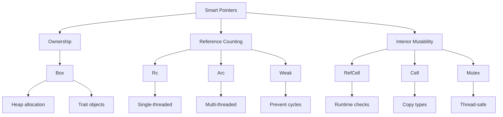

# 🧠 Smart Pointers Overview

## 🎯 Умные указатели в Rust

Smart pointers - это структуры данных, которые не только действуют как указатели, но и имеют дополнительные метаданные и возможности.

## 📚 Содержание раздела

### 1. [[02_Advanced/03_Smart_Pointers/01_Box|Box<T>]]
- Размещение на куче
- Рекурсивные типы
- Trait objects

### 2. [[02_Advanced/03_Smart_Pointers/02_Rc|Rc<T>]]
- Reference counting
- Множественное владение
- Single-threaded

### 3. [[02_Advanced/03_Smart_Pointers/03_Arc|Arc<T>]]
- Atomic reference counting
- Thread-safe Rc
- Shared ownership между потоками

### 4. [[02_Advanced/03_Smart_Pointers/04_RefCell|RefCell<T>]]
- Interior mutability
- Проверки borrowing в runtime
- Single-threaded

### 5. [[02_Advanced/03_Smart_Pointers/05_Weak|Weak<T>]]
- Слабые ссылки
- Предотвращение циклов
- Upgrade to strong reference

### 6. [[02_Advanced/03_Smart_Pointers/06_Cow|Cow<T>]]
- Clone on Write
- Отложенное клонирование
- Оптимизация производительности

## 📦 Box<T> - простейший smart pointer

```rust
// Размещение на куче
let b = Box::new(5);
println!("b = {}", b);

// Рекурсивные типы
enum List {
    Cons(i32, Box<List>),
    Nil,
}

use List::{Cons, Nil};

let list = Cons(1, Box::new(Cons(2, Box::new(Cons(3, Box::new(Nil))))));

// Trait objects
trait Draw {
    fn draw(&self);
}

let drawable: Box<dyn Draw> = Box::new(Button::new());
```

## 🔄 Rc<T> - подсчет ссылок

```rust
use std::rc::Rc;

enum List {
    Cons(i32, Rc<List>),
    Nil,
}

use List::{Cons, Nil};

let a = Rc::new(Cons(5, Rc::new(Cons(10, Rc::new(Nil)))));
println!("count after creating a = {}", Rc::strong_count(&a));

let b = Cons(3, Rc::clone(&a));
println!("count after creating b = {}", Rc::strong_count(&a));

{
    let c = Cons(4, Rc::clone(&a));
    println!("count after creating c = {}", Rc::strong_count(&a));
}

println!("count after c goes out of scope = {}", Rc::strong_count(&a));
```

## 🔒 RefCell<T> - внутренняя изменяемость

```rust
use std::cell::RefCell;

#[derive(Debug)]
struct MockMessenger {
    sent_messages: RefCell<Vec<String>>,
}

impl MockMessenger {
    fn new() -> MockMessenger {
        MockMessenger {
            sent_messages: RefCell::new(vec![]),
        }
    }
    
    fn send(&self, message: &str) {
        self.sent_messages.borrow_mut().push(String::from(message));
    }
}

// Комбинация Rc<RefCell<T>>
#[derive(Debug)]
enum List {
    Cons(Rc<RefCell<i32>>, Rc<List>),
    Nil,
}

let value = Rc::new(RefCell::new(5));

let a = Rc::new(Cons(Rc::clone(&value), Rc::new(Nil)));
let b = Cons(Rc::new(RefCell::new(3)), Rc::clone(&a));
let c = Cons(Rc::new(RefCell::new(4)), Rc::clone(&a));

*value.borrow_mut() += 10;
```

## 🗺️ Концептуальная карта



## 💻 Практический пример: График с циклами

```rust
use std::cell::RefCell;
use std::rc::{Rc, Weak};

#[derive(Debug)]
struct Node {
    value: i32,
    parent: RefCell<Weak<Node>>,
    children: RefCell<Vec<Rc<Node>>>,
}

impl Node {
    fn new(value: i32) -> Rc<Node> {
        Rc::new(Node {
            value,
            parent: RefCell::new(Weak::new()),
            children: RefCell::new(vec![]),
        })
    }
    
    fn add_child(parent: &Rc<Node>, child: Rc<Node>) {
        parent.children.borrow_mut().push(Rc::clone(&child));
        *child.parent.borrow_mut() = Rc::downgrade(parent);
    }
}

fn main() {
    let leaf = Node::new(3);
    
    println!(
        "leaf strong = {}, weak = {}",
        Rc::strong_count(&leaf),
        Rc::weak_count(&leaf),
    );
    
    {
        let branch = Node::new(5);
        Node::add_child(&branch, Rc::clone(&leaf));
        
        println!(
            "branch strong = {}, weak = {}",
            Rc::strong_count(&branch),
            Rc::weak_count(&branch),
        );
        
        println!(
            "leaf strong = {}, weak = {}",
            Rc::strong_count(&leaf),
            Rc::weak_count(&leaf),
        );
    }
    
    println!("leaf parent = {:?}", leaf.parent.borrow().upgrade());
    println!(
        "leaf strong = {}, weak = {}",
        Rc::strong_count(&leaf),
        Rc::weak_count(&leaf),
    );
}
```

## 🐄 Cow - Clone on Write

```rust
use std::borrow::Cow;

fn process_string(input: &str) -> Cow<str> {
    if input.contains("replace") {
        // Клонируем только если нужно изменить
        let mut owned = input.to_owned();
        owned = owned.replace("replace", "with");
        Cow::Owned(owned)
    } else {
        // Не клонируем если не меняем
        Cow::Borrowed(input)
    }
}

// Эффективная работа со строками
#[derive(Debug)]
struct User<'a> {
    name: Cow<'a, str>,
}

impl<'a> User<'a> {
    fn new(name: &'a str) -> Self {
        User {
            name: Cow::Borrowed(name),
        }
    }
    
    fn set_name(&mut self, name: String) {
        self.name = Cow::Owned(name);
    }
    
    fn uppercase_name(&mut self) {
        self.name = Cow::Owned(self.name.to_uppercase());
    }
}
```

## 📊 Сравнение Smart Pointers

| Pointer | Ownership | Thread-Safe | Mutability | Use Case |
|---------|-----------|-------------|------------|----------|
| `Box<T>` | Single | Yes* | Through T | Heap allocation |
| `Rc<T>` | Multiple | No | Immutable | Shared ownership (single-thread) |
| `Arc<T>` | Multiple | Yes | Immutable | Shared ownership (multi-thread) |
| `RefCell<T>` | Single | No | Interior | Runtime borrow checking |
| `Mutex<T>` | Single | Yes | Interior | Thread-safe mutability |
| `Cow<T>` | Borrowed/Owned | Depends | Depends | Lazy cloning |

*Box<T> is Send/Sync if T is Send/Sync

## 🎯 Проверка понимания

- [ ] Понимаю разницу между Box, Rc, Arc
- [ ] Знаю, что такое interior mutability
- [ ] Могу предотвратить циклы с Weak
- [ ] Умею использовать Cow для оптимизации
- [ ] Понимаю Deref и Drop traits

## ⚠️ Частые проблемы

### Reference Cycles
```rust
// ❌ Цикл приводит к утечке памяти
use std::rc::Rc;
use std::cell::RefCell;

struct Node {
    next: Option<Rc<RefCell<Node>>>,
}

// Создаем цикл
let a = Rc::new(RefCell::new(Node { next: None }));
let b = Rc::new(RefCell::new(Node { next: Some(Rc::clone(&a)) }));
a.borrow_mut().next = Some(Rc::clone(&b)); // Цикл!

// ✅ Используем Weak для обратных ссылок
struct BetterNode {
    next: Option<Rc<RefCell<BetterNode>>>,
    prev: Option<Weak<RefCell<BetterNode>>>,
}
```

### Runtime Panics с RefCell
```rust
// ❌ Panic at runtime
let cell = RefCell::new(5);
let borrow1 = cell.borrow_mut();
let borrow2 = cell.borrow_mut(); // PANIC!

// ✅ Проверяем с try_borrow
if let Ok(mut borrow) = cell.try_borrow_mut() {
    *borrow += 1;
}
```

## 📝 Упражнения

1. **Linked List**: Реализуйте с Box
2. **Tree Structure**: Дерево с Rc и Weak
3. **Cache System**: Кэш с RefCell
4. **Thread Pool**: Используйте Arc для shared state

## 🔗 Следующие шаги

- [[02_Advanced/01_Concurrency/00_Index|Concurrency]] - Arc в многопоточности
- [[01_Core/02_Ownership/00_Index|Ownership]] - основы владения
- [[02_Advanced/06_Performance/00_Index|Performance]] - оптимизация с Cow

## 📚 Ресурсы

- [Rust Book Ch. 15](https://doc.rust-lang.org/book/ch15-00-smart-pointers.html)
- [Too Many Linked Lists](https://rust-unofficial.github.io/too-many-lists/)
- [[Common Errors|Smart Pointer Pitfalls]]

---
#rust #smart-pointers #memory #advanced
