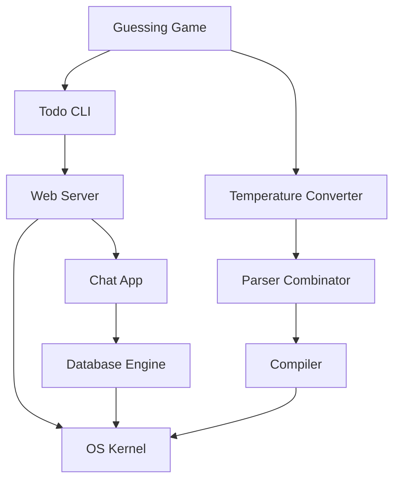

# 🚀 Projects Index

## 📋 Структура проектов

### 🎯 Уровень 1: Начальные проекты

#### [[03_Projects/01_Beginner/01_Guessing_Game|Игра "Угадай число"]]
- **Концепции**: переменные, циклы, match, обработка ввода
- **Сложность**: ⭐
- **Время**: 2-3 часа
- **Связанные темы**: [[01_Core/01_Basics/04_Control_Flow|Control Flow]], [[01_Core/08_Error_Handling/02_Result_Type|Result]]

#### [[03_Projects/01_Beginner/02_Temperature_Converter|Конвертер температур]]
- **Концепции**: функции, модули, тесты
- **Сложность**: ⭐
- **Время**: 1-2 часа
- **Связанные темы**: [[01_Core/01_Basics/03_Functions|Functions]], [[Testing in Rust]]

#### [[03_Projects/01_Beginner/03_Todo_CLI|CLI Todo приложение]]
- **Концепции**: структуры, векторы, файловый I/O
- **Сложность**: ⭐⭐
- **Время**: 4-5 часов
- **Связанные темы**: [[01_Core/05_Structs_Enums/01_Structs|Structs]], [[Collections]], [[File IO]]

### 🎯 Уровень 2: Средние проекты

#### [[03_Projects/02_Intermediate/01_Web_Server|Простой веб-сервер]]
- **Концепции**: многопоточность, TCP, HTTP
- **Сложность**: ⭐⭐⭐
- **Время**: 8-10 часов
- **Связанные темы**: [[02_Advanced/01_Concurrency/00_Index|Concurrency]], [[Networking]]

#### [[03_Projects/02_Intermediate/02_Parser_Combinator|Parser Combinator]]
- **Концепции**: трейты, дженерики, замыкания
- **Сложность**: ⭐⭐⭐
- **Время**: 10-12 часов
- **Связанные темы**: [[01_Core/06_Traits/00_Index|Traits]], [[01_Core/07_Generics/00_Index|Generics]]

#### [[03_Projects/02_Intermediate/03_Chat_Application|Чат-приложение]]
- **Концепции**: async/await, WebSockets, channels
- **Сложность**: ⭐⭐⭐⭐
- **Время**: 15-20 часов
- **Связанные темы**: [[02_Advanced/02_Async/00_Index|Async]], [[Message Passing]]

### 🎯 Уровень 3: Продвинутые проекты

#### [[03_Projects/03_Advanced/01_Database_Engine|Мини база данных]]
- **Концепции**: B-деревья, сериализация, транзакции
- **Сложность**: ⭐⭐⭐⭐⭐
- **Время**: 30+ часов
- **Связанные темы**: [[Data Structures]], [[02_Advanced/05_Unsafe/00_Index|Unsafe]]

#### [[03_Projects/03_Advanced/02_Compiler|Простой компилятор]]
- **Концепции**: лексер, парсер, AST, кодогенерация
- **Сложность**: ⭐⭐⭐⭐⭐
- **Время**: 40+ часов
- **Связанные темы**: [[02_Advanced/04_Macros/00_Index|Macros]], [[Pattern Matching]]

#### [[03_Projects/03_Advanced/03_OS_Kernel|Мини ОС]]
- **Концепции**: unsafe, ассемблер, системное программирование
- **Сложность**: ⭐⭐⭐⭐⭐
- **Время**: 50+ часов
- **Связанные темы**: [[02_Advanced/05_Unsafe/00_Index|Unsafe Rust]], [[FFI]]

## 📊 Roadmap проектов



## 📝 Шаблон для нового проекта

### Структура проекта
```
project_name/
├── Cargo.toml
├── README.md
├── src/
│   ├── main.rs
│   ├── lib.rs
│   └── modules/
├── tests/
│   └── integration_tests.rs
├── examples/
│   └── example.rs
└── docs/
    └── ARCHITECTURE.md
```

### Cargo.toml шаблон
```toml
[package]
name = "project_name"
version = "0.1.0"
edition = "2021"

[dependencies]
# Основные зависимости

[dev-dependencies]
# Зависимости для тестов

[profile.release]
opt-level = 3
lto = true
```

## 🎯 Методология работы над проектами

### Фаза 1: Планирование
- [ ] Определить требования
- [ ] Создать архитектуру
- [ ] Разбить на задачи
- [ ] Оценить время

### Фаза 2: Разработка
- [ ] Написать тесты
- [ ] Реализовать функционал
- [ ] Провести рефакторинг
- [ ] Документировать код

### Фаза 3: Завершение
- [ ] Code review
- [ ] Оптимизация
- [ ] Написать README
- [ ] Создать примеры использования

## 🔧 Инструменты для проектов

- **cargo-watch** - автоматическая перекомпиляция
- **cargo-expand** - просмотр раскрытых макросов
- **flamegraph** - профилирование производительности
- **cargo-audit** - проверка безопасности зависимостей

## 📚 Ресурсы для вдохновения

- [Rust by Example](https://doc.rust-lang.org/rust-by-example/)
- [Too Many Lists](https://rust-unofficial.github.io/too-many-lists/)
- [Writing an OS in Rust](https://os.phil-opp.com/)
- [Build Your Own X](https://github.com/codecrafters-io/build-your-own-x)

---
#rust #projects #practice
