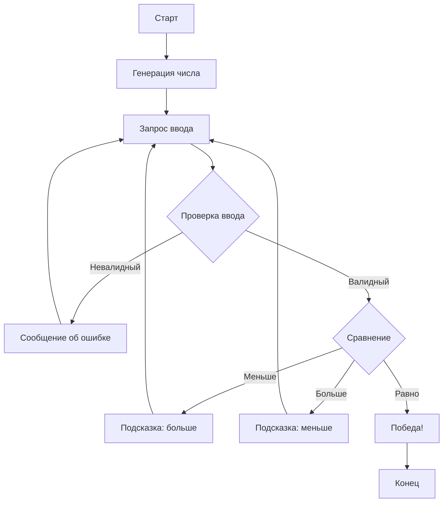

# 🎲 Проект: Игра "Угадай число"

## 📋 Описание проекта

Классическая игра, где компьютер загадывает число от 1 до 100, а игрок пытается его угадать. После каждой попытки игрок получает подсказку: загаданное число больше или меньше.

## 🎯 Цели обучения

- [ ] Работа с вводом/выводом
- [ ] Использование внешних крейтов
- [ ] Обработка ошибок с `Result`
- [ ] Pattern matching с `match`
- [ ] Циклы и условия
- [ ] Генерация случайных чисел

## 📊 Архитектура проекта



## 💻 Пошаговая реализация

### Шаг 1: Создание проекта
```bash
cargo new guessing_game
cd guessing_game
```

### Шаг 2: Добавление зависимостей
```toml
# Cargo.toml
[dependencies]
rand = "0.8"
colored = "2.0"  # Для цветного вывода
```

### Шаг 3: Основной код
```rust
use std::io;
use std::cmp::Ordering;
use rand::Rng;
use colored::*;

fn main() {
    println!("{}", "🎲 Добро пожаловать в игру 'Угадай число'!".green().bold());
    
    // Генерируем случайное число
    let secret_number = rand::thread_rng().gen_range(1..=100);
    let mut attempts = 0;
    
    println!("Я загадал число от 1 до 100. Попробуй угадать!");
    
    loop {
        println!("\n{}", "Введите ваше предположение:".cyan());
        
        let mut guess = String::new();
        
        io::stdin()
            .read_line(&mut guess)
            .expect("Не удалось прочитать строку");
        
        // Парсим ввод
        let guess: u32 = match guess.trim().parse() {
            Ok(num) => num,
            Err(_) => {
                println!("{}", "❌ Пожалуйста, введите число!".red());
                continue;
            }
        };
        
        attempts += 1;
        println!("Вы предположили: {}", guess.to_string().yellow());
        
        // Сравниваем числа
        match guess.cmp(&secret_number) {
            Ordering::Less => println!("{}", "📈 Слишком маленькое!".blue()),
            Ordering::Greater => println!("{}", "📉 Слишком большое!".blue()),
            Ordering::Equal => {
                println!("{}", 
                    format!("🎉 Поздравляю! Вы угадали число {} за {} попыток!", 
                        secret_number, attempts).green().bold()
                );
                break;
            }
        }
    }
}
```

## 🔄 Улучшения и расширения

### Версия 2: Добавляем сложность
```rust
#[derive(Debug)]
enum Difficulty {
    Easy,    // 1-50
    Medium,  // 1-100
    Hard,    // 1-200
}

impl Difficulty {
    fn get_range(&self) -> std::ops::RangeInclusive<u32> {
        match self {
            Difficulty::Easy => 1..=50,
            Difficulty::Medium => 1..=100,
            Difficulty::Hard => 1..=200,
        }
    }
    
    fn get_max_attempts(&self) -> u32 {
        match self {
            Difficulty::Easy => 10,
            Difficulty::Medium => 7,
            Difficulty::Hard => 5,
        }
    }
}
```

### Версия 3: Система подсказок
```rust
struct Hint {
    attempts_left: u32,
    is_even: bool,
    digit_sum: u32,
    is_prime: bool,
}

impl Hint {
    fn new(number: u32, max_attempts: u32, current_attempt: u32) -> Self {
        Hint {
            attempts_left: max_attempts - current_attempt,
            is_even: number % 2 == 0,
            digit_sum: Self::calculate_digit_sum(number),
            is_prime: Self::is_prime(number),
        }
    }
    
    fn calculate_digit_sum(mut n: u32) -> u32 {
        let mut sum = 0;
        while n > 0 {
            sum += n % 10;
            n /= 10;
        }
        sum
    }
    
    fn is_prime(n: u32) -> bool {
        if n <= 1 { return false; }
        if n <= 3 { return true; }
        if n % 2 == 0 || n % 3 == 0 { return false; }
        
        let mut i = 5;
        while i * i <= n {
            if n % i == 0 || n % (i + 2) == 0 {
                return false;
            }
            i += 6;
        }
        true
    }
}
```

### Версия 4: Статистика игр
```rust
use serde::{Serialize, Deserialize};
use std::fs;

#[derive(Serialize, Deserialize)]
struct GameStats {
    total_games: u32,
    total_attempts: u32,
    best_score: u32,
    average_attempts: f32,
    difficulty_distribution: HashMap<String, u32>,
}

impl GameStats {
    fn load() -> Result<Self, Box<dyn std::error::Error>> {
        let data = fs::read_to_string("stats.json")?;
        Ok(serde_json::from_str(&data)?)
    }
    
    fn save(&self) -> Result<(), Box<dyn std::error::Error>> {
        let json = serde_json::to_string_pretty(self)?;
        fs::write("stats.json", json)?;
        Ok(())
    }
    
    fn update(&mut self, attempts: u32, difficulty: &Difficulty) {
        self.total_games += 1;
        self.total_attempts += attempts;
        
        if attempts < self.best_score || self.best_score == 0 {
            self.best_score = attempts;
        }
        
        self.average_attempts = self.total_attempts as f32 / self.total_games as f32;
        
        let diff_key = format!("{:?}", difficulty);
        *self.difficulty_distribution.entry(diff_key).or_insert(0) += 1;
    }
}
```

## 🧪 Тесты

```rust
#[cfg(test)]
mod tests {
    use super::*;
    
    #[test]
    fn test_difficulty_ranges() {
        assert_eq!(Difficulty::Easy.get_range(), 1..=50);
        assert_eq!(Difficulty::Medium.get_range(), 1..=100);
        assert_eq!(Difficulty::Hard.get_range(), 1..=200);
    }
    
    #[test]
    fn test_digit_sum() {
        assert_eq!(Hint::calculate_digit_sum(123), 6);
        assert_eq!(Hint::calculate_digit_sum(999), 27);
        assert_eq!(Hint::calculate_digit_sum(0), 0);
    }
    
    #[test]
    fn test_prime_checker() {
        assert!(Hint::is_prime(2));
        assert!(Hint::is_prime(17));
        assert!(!Hint::is_prime(1));
        assert!(!Hint::is_prime(100));
    }
}
```

## 📝 Задания для самостоятельной работы

1. **Добавить таймер** - ограничить время на каждую попытку
2. **Мультиплеер** - режим для двух игроков
3. **GUI версия** - используя `egui` или `iced`
4. **Web версия** - используя `wasm-bindgen`
5. **AI противник** - компьютер угадывает ваше число

## 🔗 Связанные темы

- [[01_Core/01_Basics/04_Control_Flow|Control Flow]] - циклы и условия
- [[01_Core/08_Error_Handling/02_Result_Type|Result Type]] - обработка ошибок
- [[Pattern Matching]] - работа с `match`
- [[External Crates]] - использование внешних библиотек
- [[Testing in Rust]] - написание тестов

## 📚 Ресурсы

- [Rust Book - Guessing Game](https://doc.rust-lang.org/book/ch02-00-guessing-game-tutorial.html)
- [rand crate documentation](https://docs.rs/rand/)
- [[03_Projects/01_Beginner/03_Todo_CLI|Следующий проект: Todo CLI]]

---
#rust #project #beginner #game
