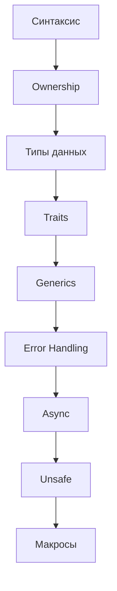

# 🎯 Flashcards Hub

## 📚 Система флеш-карточек для изучения Rust

> 💡 **Как использовать**: Установите плагин **Obsidian Spaced Repetition** для работы с карточками. Карточки помечены тегом `#flashcard` и используют формат вопрос-ответ.

## 📊 Категории карточек

### [[04_Flashcards/01_Syntax|📝 Синтаксис]]
Базовый синтаксис и конструкции языка
- Переменные и типы
- Функции и замыкания
- Управляющие конструкции

### [[04_Flashcards/02_Ownership|🔑 Ownership & Borrowing]]
Система владения и заимствования
- Правила владения
- Ссылки и заимствование
- Времена жизни

### [[04_Flashcards/03_Types|🎨 Типы и структуры данных]]
Работа с типами данных
- Примитивные типы
- Структуры и енумы
- Коллекции

### [[04_Flashcards/04_Traits|🔧 Traits & Generics]]
Трейты и обобщенное программирование
- Определение трейтов
- Дженерики
- Trait bounds

### [[04_Flashcards/05_Advanced|⚡ Продвинутые темы]]
Сложные концепции
- Async/Await
- Unsafe Rust
- Макросы

### [[04_Flashcards/06_Patterns|🎯 Паттерны и best practices]]
Идиомы и паттерны Rust
- Error handling паттерны
- Builder pattern
- RAII

## 📈 Статистика изучения

```dataview
TABLE 
    length(filter(file.tags, (t) => t = "#flashcard")) as "Карточки",
    length(filter(file.tags, (t) => t = "#flashcard/review")) as "На повторение",
    length(filter(file.tags, (t) => t = "#flashcard/hard")) as "Сложные"
FROM "04_Flashcards"
WHERE file.name != "00_Index"
```

## 🎓 Рекомендуемый порядок изучения



## ⚙️ Настройки Spaced Repetition

Рекомендуемые настройки для плагина:

```yaml
# Интервалы повторения (в днях)
intervals:
  - 1    # Первое повторение
  - 3    # Второе повторение
  - 7    # Третье повторение
  - 14   # Четвертое повторение
  - 30   # Пятое повторение
  - 90   # Шестое повторение

# Множители для корректировки интервалов
ease_factors:
  hard: 0.6
  good: 1.0
  easy: 1.3

# Максимальный интервал
max_interval: 365

# Количество новых карточек в день
new_cards_per_day: 10

# Количество карточек на повторение в день
review_cards_per_day: 20
```

## 📝 Шаблон создания карточки

```markdown
#flashcard 
Q: [Вопрос]
A: [Ответ]
<!--SR:!2024-01-15,3,250-->

Дополнительные пояснения (не включаются в карточку):
- Пример кода
- Ссылки на документацию
- Связанные концепции
```

## 🔥 Горячие клавиши

- `Ctrl+Shift+S` - Начать сессию повторения
- `1` - Отметить как "Сложно"
- `2` - Отметить как "Хорошо"
- `3` - Отметить как "Легко"
- `Space` - Показать ответ

## 📊 Прогресс по темам

- [ ] Базовый синтаксис (50 карточек)
- [ ] Ownership система (40 карточек)
- [ ] Структуры данных (35 карточек)
- [ ] Трейты (30 карточек)
- [ ] Обработка ошибок (25 карточек)
- [ ] Дженерики (20 карточек)
- [ ] Async программирование (30 карточек)
- [ ] Unsafe Rust (15 карточек)
- [ ] Макросы (20 карточек)

**Всего: 265 карточек**

## 🎯 Советы по эффективному изучению

1. **Регулярность важнее объема** - лучше 10 карточек каждый день, чем 70 раз в неделю
2. **Создавайте свои карточки** - процесс создания помогает запоминанию
3. **Используйте примеры кода** - конкретные примеры запоминаются лучше абстрактных правил
4. **Связывайте концепции** - создавайте ментальные связи между темами
5. **Практикуйтесь параллельно** - применяйте изученное в проектах

---
#rust #flashcards #learning #spaced-repetition
