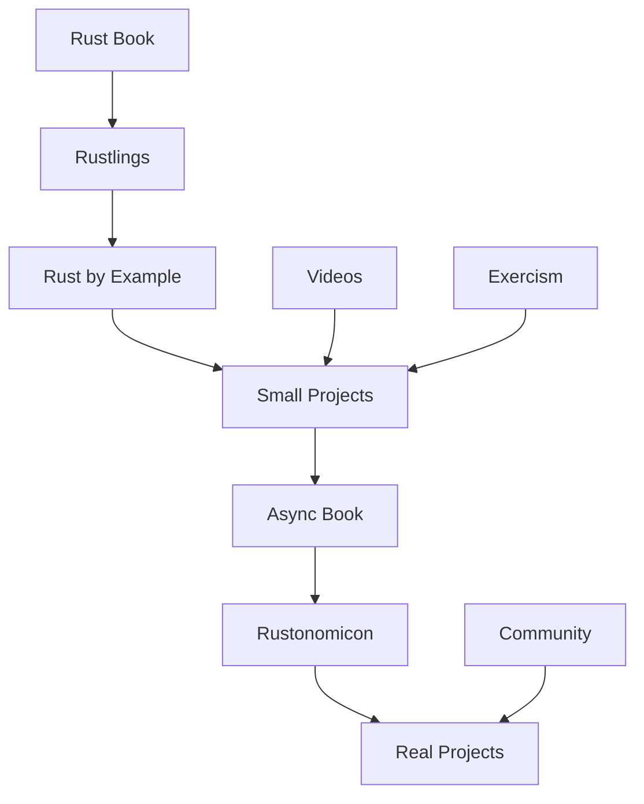

# 📖 Resources Hub

## 📚 Организация учебных ресурсов

### 📖 [[05_Resources/01_Books|Книги]]
- Официальные книги Rust
- Продвинутая литература
- Специализированные темы

### 🎥 [[05_Resources/02_Videos|Видео курсы]]
- YouTube каналы
- Платные курсы
- Конференции и доклады

### 🔗 [[05_Resources/03_Websites|Веб-сайты]]
- Официальная документация
- Блоги и статьи
- Интерактивные учебники

### 🛠️ [[05_Resources/04_Tools|Инструменты]]
- IDE и редакторы
- Cargo плагины
- Отладчики и профайлеры

### 👥 [[05_Resources/05_Community|Сообщество]]
- Discord серверы
- Reddit
- Форумы и чаты

### 📝 [[05_Resources/06_Cheatsheets|Шпаргалки]]
- Синтаксис
- Lifetime правила
- Cargo команды

## 🎯 Quick Links

### Официальные ресурсы
- 📕 [The Rust Book](https://doc.rust-lang.org/book/)
- 📗 [Rust by Example](https://doc.rust-lang.org/rust-by-example/)
- 📘 [Rust Reference](https://doc.rust-lang.org/reference/)
- 📙 [Rustonomicon](https://doc.rust-lang.org/nomicon/)
- 📓 [Async Book](https://rust-lang.github.io/async-book/)

### Практика
- 🎮 [Rustlings](https://github.com/rust-lang/rustlings)
- 🏋️ [Exercism](https://exercism.io/tracks/rust)
- ⚔️ [Codewars](https://www.codewars.com/?language=rust)
- 🏆 [Advent of Code](https://adventofcode.com/)

### Документация
- 📦 [docs.rs](https://docs.rs/) - документация всех крейтов
- 🦀 [crates.io](https://crates.io/) - репозиторий пакетов
- 📊 [lib.rs](https://lib.rs/) - альтернативный каталог крейтов

## 📊 Roadmap изучения



## 🗓️ План изучения на 3 месяца

### Месяц 1: Основы
**Неделя 1-2:**
- [ ] The Rust Book (главы 1-6)
- [ ] Rustlings (переменные, функции, if)
- [ ] Настройка окружения

**Неделя 3-4:**
- [ ] The Rust Book (главы 7-10)
- [ ] Rustlings (структуры, енумы, модули)
- [ ] Первый проект: CLI приложение

### Месяц 2: Углубление
**Неделя 5-6:**
- [ ] The Rust Book (главы 11-15)
- [ ] Exercism (20 задач)
- [ ] Проект: Web сервер

**Неделя 7-8:**
- [ ] The Rust Book (главы 16-20)
- [ ] Изучение популярных крейтов
- [ ] Проект: REST API

### Месяц 3: Продвинутые темы
**Неделя 9-10:**
- [ ] Async Book
- [ ] Tokio tutorial
- [ ] Проект: Async приложение

**Неделя 11-12:**
- [ ] Rustonomicon (выборочно)
- [ ] Оптимизация и профилирование
- [ ] Финальный проект

## 🏆 Сертификации и курсы

### Бесплатные курсы
- **Rust Fundamentals** - Pluralsight
- **Rust Programming** - Coursera
- **Tour of Rust** - интерактивный тур

### Платные курсы
- **Zero to Production in Rust** - Luca Palmieri
- **Rust for Rustaceans** - Jon Gjengset
- **Ultimate Rust** - Nathan Stocks

## 📈 Метрики прогресса

```dataview
TABLE 
    status as "Статус",
    difficulty as "Сложность",
    time_spent as "Время"
FROM "05_Resources"
WHERE type = "course" OR type = "book"
SORT difficulty ASC
```

## 🎯 Челленджи и соревнования

### Регулярные
- **Advent of Code** (декабрь)
- **Google Code Jam**
- **Rust GameDev competitions**

### Постоянные
- **100 Days of Rust**
- **30 Day Rust Challenge**
- **Build Your Own X in Rust**

## 📝 Шаблоны для заметок

### Шаблон изучения книги
```markdown
# 📖 [Название книги]

## 📋 Информация
- **Автор**: 
- **Год**: 
- **Страниц**: 
- **Уровень**: Beginner/Intermediate/Advanced

## 🎯 Цели изучения
- [ ] 
- [ ] 

## 📝 Конспект по главам
### Глава 1: 
- Ключевые концепции:
- Примеры кода:
- Вопросы:

## 💡 Ключевые выводы

## 🔗 Связанные темы
```

### Шаблон для видео
```markdown
# 🎥 [Название видео]

## 📋 Информация
- **Автор**: 
- **Длительность**: 
- **Ссылка**: 
- **Уровень**: 

## ⏱️ Таймкоды
- 00:00 - 
- 05:00 - 

## 📝 Основные тезисы

## 💻 Код из видео

## 🔗 Упомянутые ресурсы
```

---
#rust #resources #learning #books #videos #tools
