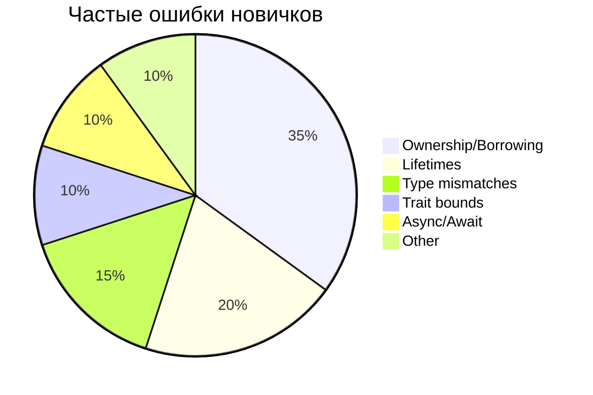

# ❌ Common Rust Errors and Solutions

## 🔴 Ошибки владения (Ownership Errors)

### E0382: Use of moved value
```rust
// ❌ Ошибка
let s1 = String::from("hello");
let s2 = s1;
println!("{}", s1); // ERROR: value borrowed here after move

// ✅ Решение 1: Клонирование
let s1 = String::from("hello");
let s2 = s1.clone();
println!("{}", s1); // OK

// ✅ Решение 2: Заимствование
let s1 = String::from("hello");
let s2 = &s1;
println!("{}", s1); // OK
```

### E0499: Cannot borrow as mutable more than once
```rust
// ❌ Ошибка
let mut s = String::from("hello");
let r1 = &mut s;
let r2 = &mut s; // ERROR: second mutable borrow

// ✅ Решение: Использовать области видимости
let mut s = String::from("hello");
{
    let r1 = &mut s;
} // r1 выходит из области видимости
let r2 = &mut s; // OK
```

### E0506: Cannot assign to borrowed value
```rust
// ❌ Ошибка
let mut x = 5;
let y = &x;
x = 6; // ERROR: cannot assign to `x` because it is borrowed

// ✅ Решение: Ограничить область заимствования
let mut x = 5;
{
    let y = &x;
    // использовать y
}
x = 6; // OK
```

## 🟠 Ошибки времени жизни (Lifetime Errors)

### E0106: Missing lifetime specifier
```rust
// ❌ Ошибка
struct Book {
    title: &str, // ERROR: missing lifetime specifier
}

// ✅ Решение: Добавить lifetime параметр
struct Book<'a> {
    title: &'a str,
}
```

### E0597: Borrowed value does not live long enough
```rust
// ❌ Ошибка
fn dangle() -> &String {
    let s = String::from("hello");
    &s // ERROR: `s` does not live long enough
}

// ✅ Решение: Вернуть владение
fn no_dangle() -> String {
    let s = String::from("hello");
    s
}
```

## 🟡 Ошибки типов (Type Errors)

### E0308: Mismatched types
```rust
// ❌ Ошибка
let x: i32 = "hello"; // ERROR: expected `i32`, found `&str`

// ✅ Решение: Использовать правильный тип
let x: i32 = 42;
let y: &str = "hello";
```

### E0277: Trait not implemented
```rust
// ❌ Ошибка
fn print_it<T>(item: T) {
    println!("{}", item); // ERROR: `T` doesn't implement `Display`
}

// ✅ Решение: Добавить trait bound
fn print_it<T: std::fmt::Display>(item: T) {
    println!("{}", item);
}
```

## 🟢 Ошибки конкурентности (Concurrency Errors)

### E0373: Closure may outlive function
```rust
// ❌ Ошибка
use std::thread;

fn main() {
    let v = vec![1, 2, 3];
    let handle = thread::spawn(|| {
        println!("Here's a vector: {:?}", v); // ERROR
    });
}

// ✅ Решение: Использовать move
let handle = thread::spawn(move || {
    println!("Here's a vector: {:?}", v);
});
```

### Deadlock
```rust
// ❌ Проблема: Потенциальный deadlock
use std::sync::Mutex;

let mutex1 = Mutex::new(5);
let mutex2 = Mutex::new(10);

// Thread 1
let guard1 = mutex1.lock().unwrap();
let guard2 = mutex2.lock().unwrap();

// Thread 2
let guard2 = mutex2.lock().unwrap();
let guard1 = mutex1.lock().unwrap();

// ✅ Решение: Всегда захватывать в одном порядке
// Или использовать parking_lot с deadlock detection
```

## 🔵 Ошибки макросов (Macro Errors)

### Macro expansion errors
```rust
// ❌ Ошибка
macro_rules! my_macro {
    ($x:expr) => {
        $x + $x // ERROR: cannot add
    };
}

// ✅ Решение: Убедиться в правильности типов
macro_rules! my_macro {
    ($x:expr) => {{
        let val = $x;
        val + val
    }};
}
```

## 🟣 Async/Await ошибки

### Cannot await outside async context
```rust
// ❌ Ошибка
fn not_async() {
    async_function().await; // ERROR: await outside async
}

// ✅ Решение: Сделать функцию async
async fn is_async() {
    async_function().await;
}
```

### Future is not Send
```rust
// ❌ Проблема
use std::rc::Rc;

async fn not_send() {
    let rc = Rc::new(5);
    async_op().await; // Rc не Send!
}

// ✅ Решение: Использовать Arc
use std::sync::Arc;

async fn is_send() {
    let arc = Arc::new(5);
    async_op().await;
}
```

## 📊 Частотность ошибок



## 🛠️ Инструменты для отладки

### rustc --explain
```bash
rustc --explain E0382  # Подробное объяснение ошибки
```

### cargo clippy
```bash
cargo clippy -- -W clippy::all  # Дополнительные предупреждения
```

### RUST_BACKTRACE
```bash
RUST_BACKTRACE=1 cargo run  # Полный стек вызовов при панике
```

## 💡 Общие советы

1. **Читайте сообщения об ошибках** - Rust имеет очень информативные ошибки
2. **Используйте `cargo check`** - Быстрая проверка без компиляции
3. **Изучите lifetime elision rules** - Многие lifetimes выводятся автоматически
4. **Практикуйте pattern matching** - Помогает избежать многих ошибок
5. **Используйте `#[derive(Debug)]`** - Для удобной отладки

## 🔗 Связанные темы

- [[01_Core/02_Ownership/01_Ownership_Rules|Ownership Rules]]
- [[01_Core/04_Lifetimes/01_Lifetime_Basics|Lifetimes]]
- [[01_Core/08_Error_Handling/00_Index|Error Handling]]
- [[02_Advanced/02_Async/05_Error_Handling|Async Error Handling]]

---
#rust #errors #debugging #troubleshooting
