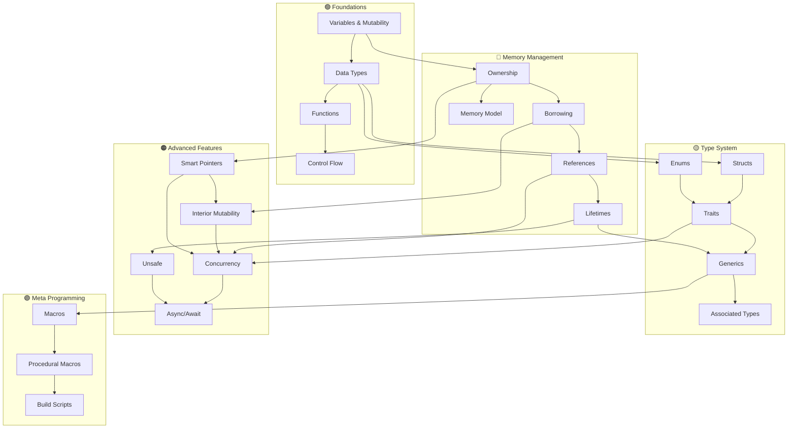
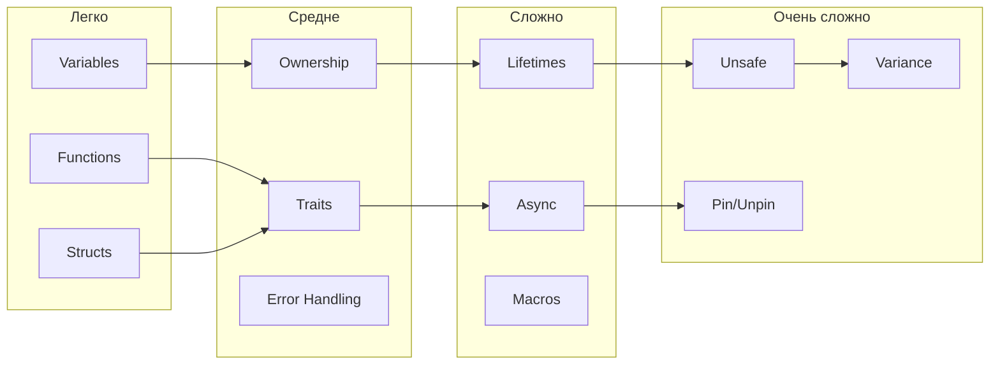

# 🗺️ Rust Concepts Map

## 🌐 Интерактивная карта концепций

Эта карта показывает связи между различными концепциями Rust. Используйте граф Obsidian для визуализации связей!

## 📊 Основная карта зависимостей



## 🔗 Детальные связи концепций

### Ownership влияет на:
- [[01_Core/03_Borrowing/01_References|Borrowing]] - правила заимствования основаны на ownership
- [[01_Core/02_Ownership/03_Move_Semantics|Move Semantics]] - перемещение владения
- [[02_Advanced/03_Smart_Pointers/01_Box|Smart Pointers]] - управление владением на куче
- [[01_Core/08_Error_Handling/00_Index|Error Handling]] - владение ошибками

### Lifetimes связаны с:
- [[01_Core/03_Borrowing/01_References|References]] - время жизни ссылок
- [[01_Core/07_Generics/00_Index|Generics]] - generic lifetime parameters
- [[01_Core/06_Traits/00_Index|Traits]] - lifetime bounds в трейтах
- [[02_Advanced/02_Async/01_Futures|Async]] - Pin и self-referential структуры

### Traits необходимы для:
- [[01_Core/07_Generics/00_Index|Generics]] - trait bounds
- [[01_Core/08_Error_Handling/00_Index|Error Handling]] - Error trait
- [[02_Advanced/01_Concurrency/04_Sync_Send|Concurrency]] - Send и Sync traits
- [[02_Advanced/02_Async/01_Futures|Async]] - Future trait

### Smart Pointers включают:
- [[02_Advanced/03_Smart_Pointers/01_Box|Box]] → простое выделение на куче
- [[02_Advanced/03_Smart_Pointers/02_Rc|Rc]] → подсчет ссылок
- [[02_Advanced/03_Smart_Pointers/03_Arc|Arc]] → атомарный подсчет ссылок
- [[02_Advanced/03_Smart_Pointers/04_RefCell|RefCell]] → внутренняя изменяемость

## 🎯 Пути изучения

### Path 1: Классический путь
```
Syntax → Data Types → Functions → Ownership → Borrowing → 
→ Structs → Enums → Error Handling → Traits → Generics
```

### Path 2: Практический путь
```
Hello World → Variables → Control Flow → Structs → 
→ Impl blocks → Collections → Error Handling → Modules → Testing
```

### Path 3: Системный путь
```
Memory Model → Stack vs Heap → Ownership → Move/Copy → 
→ References → Lifetimes → Smart Pointers → Unsafe
```

### Path 4: Async путь
```
Functions → Traits → Generics → Closures → 
→ Futures → Async/Await → Tokio → Streams
```

## 📈 Сложность концепций



## 🔄 Циклические зависимости

Некоторые концепции взаимозависимы:

- **Traits ↔ Generics**: Traits используют generics, generics используют trait bounds
- **Lifetimes ↔ References**: Ссылки имеют lifetime, lifetime описывает валидность ссылок
- **Async ↔ Futures**: Async функции возвращают Future, Future реализуют async поведение

## 🎨 Паттерны и идиомы

### Newtype Pattern
```
Structs → Traits → Type Safety
```

### Builder Pattern
```
Structs → Methods → Ownership → Generics
```

### RAII Pattern
```
Ownership → Drop Trait → Smart Pointers
```

### Interior Mutability
```
Borrowing Rules → RefCell → Rc/Arc
```

## 📚 Prerequisite Map

| Концепция | Необходимые знания | Рекомендуемые знания |
|-----------|-------------------|---------------------|
| **Ownership** | Variables, Memory basics | Stack vs Heap |
| **Borrowing** | Ownership | References in C/C++ |
| **Lifetimes** | Borrowing, References | Scope concepts |
| **Traits** | Structs, Functions | OOP interfaces |
| **Generics** | Functions, Types | Templates (C++) |
| **Smart Pointers** | Ownership, Heap | Pointers in C |
| **Concurrency** | Ownership, Closures | Threading basics |
| **Async** | Traits, Closures | Event loops |
| **Macros** | Syntax, Patterns | Metaprogramming |
| **Unsafe** | All core concepts | Assembly, C |

## 🔍 Где искать помощь

### Легкие вопросы
- [[Rust Cheatsheet]]
- [[04_Flashcards/01_Syntax|Syntax Flashcards]]

### Средние вопросы
- [[Common Errors]]
- [[01_Core/00_Index|Core Concepts]]

### Сложные вопросы
- [[02_Advanced/00_Index|Advanced Topics]]
- [[Interview Questions]]

### Практика
- [[03_Projects/00_Index|Projects]]
- [[Code Snippets]]

## 🌟 Ключевые инсайты

1. **Ownership - это фундамент** всей системы типов Rust
2. **Lifetimes - это проверка ссылок** во время компиляции
3. **Traits - это контракты** для типов
4. **Generics - это параметризация** кода
5. **Smart Pointers - это абстракции** над raw pointers
6. **Async - это кооперативная многозадачность**
7. **Unsafe - это escape hatch** для системного программирования

---
#rust #concepts #map #relationships #learning-path
