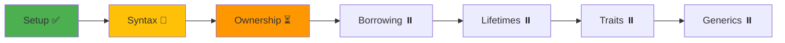

# 🚀 Rust Learning Dashboard

## 📊 Quick Stats
- **Current Streak**: 0 days
- **Total Hours**: 0
- **Projects Completed**: 0/10
- **Current Level**: 🟢 Beginner

## 🎯 Today's Focus
- [ ] Morning: Study [[01_Core/02_Ownership/01_Ownership_Rules|Ownership Rules]]
- [ ] Afternoon: Practice [[Practice Exercises|Exercises]]
- [ ] Evening: Review [[04_Flashcards/00_Index|Flashcards]]

## 📚 Quick Navigation

### Core Learning
- 📖 [[🦀 Rust Learning Hub|Main Hub]]
- 🗺️ [[Concepts Map|Concept Relationships]]
- 📈 [[Learning Progress|Progress Tracker]]

### Study Materials
- 📚 [[01_Core/00_Index|Core Concepts]]
- 🔹 [[02_Advanced/00_Index|Advanced Topics]]
- 📖 [[05_Resources/00_Index|Resources]]

### Practice
- 🚀 [[03_Projects/00_Index|Projects]]
- 🏋️ [[Practice Exercises|Exercises]]
- 📝 [[Code Snippets|Snippets]]

### Review
- 🎯 [[04_Flashcards/00_Index|Flashcards]]
- ❌ [[Common Errors|Common Errors]]
- 💼 [[Interview Questions|Interview Prep]]

### Daily Work
- 📝 [[06_Daily/00_Template|Today's Notes]]
- 🦀 [[Rust Cheatsheet|Quick Reference]]

## 🔥 Current Project
Working on: [[03_Projects/01_Beginner/01_Guessing_Game|Guessing Game]]

Progress:
```
[##########----------] 50%
```

## 📅 This Week's Goals
- [ ] Complete 3 chapters of Rust Book
- [ ] Solve 10 Rustlings exercises
- [ ] Build one small project
- [ ] Create 20 flashcards
- [ ] Write weekly reflection

## 🧠 Concept of the Day
> **Ownership**: Every value in Rust has a single owner, and when the owner goes out of scope, the value is dropped.

[[01_Core/02_Ownership/01_Ownership_Rules|Learn more →]]

## 💡 Tip of the Day
> Use `cargo clippy` to get helpful suggestions about your code style and potential improvements!

## 📊 Learning Path Progress



## 🎮 Gamification

### Badges Earned
- 🏅 First Program
- 🎖️ Hello World
- 🥉 Setup Complete

### Next Achievements
- 🥈 First Project (0/1)
- 🏆 Ownership Master (0/10 exercises)
- 💎 Trait Wizard (0/5 traits implemented)

### Skill Points
- **Syntax**: ⭐⭐⬜⬜⬜
- **Memory**: ⭐⬜⬜⬜⬜
- **Types**: ⭐⬜⬜⬜⬜
- **Async**: ⬜⬜⬜⬜⬜
- **Unsafe**: ⬜⬜⬜⬜⬜

## 🔗 Useful Links

### Documentation
- [Rust Book](https://doc.rust-lang.org/book/)
- [Rust by Example](https://doc.rust-lang.org/rust-by-example/)
- [std docs](https://doc.rust-lang.org/std/)

### Community
- [r/rust](https://reddit.com/r/rust)
- [Rust Discord](https://discord.gg/rust-lang)
- [This Week in Rust](https://this-week-in-rust.org/)

### Tools
- [Rust Playground](https://play.rust-lang.org/)
- [crates.io](https://crates.io/)
- [docs.rs](https://docs.rs/)

## 📝 Quick Notes
```rust
// Today I learned:
// - 
// - 
// - 
```

## 🎯 Focus Mode
> **Pomodoro Timer**: 🍅 25:00
> 
> Current Task: _________________
> 
> Distractions:
> - [ ] 
> - [ ] 

## 💭 Reflection Corner
**What went well today?**


**What was challenging?**


**What will I do differently tomorrow?**


---

> 🌟 **Remember**: Every expert was once a beginner. Keep coding, keep learning!

[[06_Daily/00_Template|Create Today's Note]] | [[Learning Progress|Update Progress]] | [[🦀 Rust Learning Hub|Back to Hub]]

---
#rust #dashboard #learning #progress #daily
