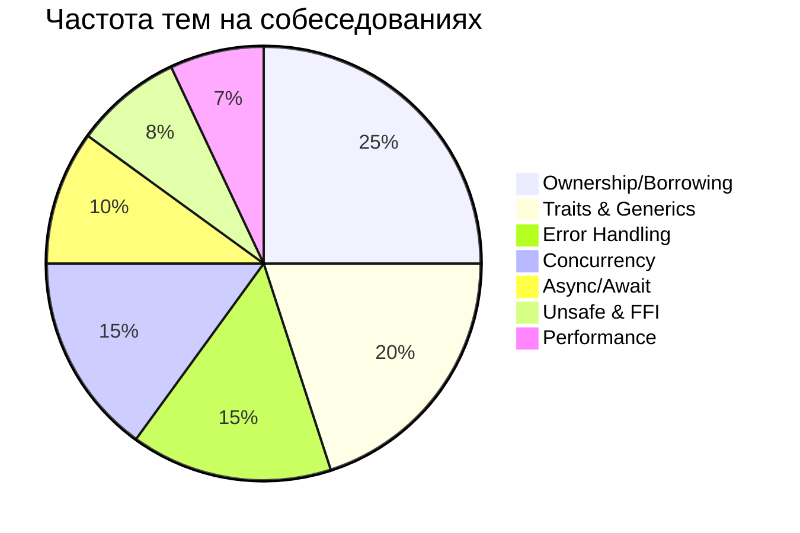

# 💼 Rust Interview Questions

## 📊 Уровни вопросов

### 🟢 Junior Level (0-2 года опыта)
### 🟡 Middle Level (2-5 лет опыта)  
### 🔴 Senior Level (5+ лет опыта)

---

## 🟢 Junior Level Questions

### 1. Что такое Ownership в Rust?
**Ответ:**
Ownership - это система управления памятью в Rust с тремя правилами:
1. У каждого значения есть владелец
2. У значения может быть только один владелец в каждый момент
3. Когда владелец выходит из области видимости, значение удаляется

```rust
let s1 = String::from("hello");
let s2 = s1; // s1 больше не валидна (move)
```

### 2. В чем разница между &T и &mut T?
**Ответ:**
- `&T` - неизменяемая ссылка, можно иметь много одновременно
- `&mut T` - изменяемая ссылка, только одна в области видимости

```rust
let mut x = 5;
let r1 = &x;      // неизменяемая
let r2 = &x;      // еще одна неизменяемая - ОК
let r3 = &mut x;  // ОШИБКА: нельзя при наличии неизменяемых
```

### 3. Что такое Result и Option?
**Ответ:**
- `Option<T>` - представляет опциональное значение (Some или None)
- `Result<T, E>` - представляет результат операции (Ok или Err)

```rust
fn divide(a: f64, b: f64) -> Option<f64> {
    if b == 0.0 { None } else { Some(a / b) }
}

fn read_file(path: &str) -> Result<String, io::Error> {
    fs::read_to_string(path)
}
```

### 4. Что такое trait?
**Ответ:**
Trait определяет функциональность, которую тип может реализовать. Похож на интерфейсы в других языках.

```rust
trait Animal {
    fn make_sound(&self) -> String;
}

struct Dog;
impl Animal for Dog {
    fn make_sound(&self) -> String {
        "Woof!".to_string()
    }
}
```

### 5. В чем разница между String и &str?
**Ответ:**
- `String` - владеющий, изменяемый, растущий тип на куче
- `&str` - неизменяемая ссылка на строку, может указывать на String или строковый литерал

```rust
let s1: String = String::from("hello");
let s2: &str = "world";
let s3: &str = &s1; // &String преобразуется в &str
```

---

## 🟡 Middle Level Questions

### 6. Объясните lifetime parameters
**Ответ:**
Lifetime параметры указывают компилятору, как долго ссылки должны быть валидными.

```rust
fn longest<'a>(x: &'a str, y: &'a str) -> &'a str {
    if x.len() > y.len() { x } else { y }
}

struct Book<'a> {
    title: &'a str,
}
```

### 7. Что такое interior mutability?
**Ответ:**
Паттерн, позволяющий изменять данные даже при неизменяемых ссылках. Реализуется через `RefCell`, `Cell`, `Mutex`.

```rust
use std::cell::RefCell;

struct Counter {
    value: RefCell<i32>,
}

impl Counter {
    fn increment(&self) { // неизменяемый &self
        *self.value.borrow_mut() += 1; // но можем изменять
    }
}
```

### 8. Как работает async/await?
**Ответ:**
Async функции возвращают Future, который представляет вычисление, которое может быть не завершено. Await приостанавливает выполнение до готовности Future.

```rust
async fn fetch_data() -> Result<String, Error> {
    let response = client.get(url).await?;
    let text = response.text().await?;
    Ok(text)
}
```

### 9. В чем разница между Box, Rc и Arc?
**Ответ:**
- `Box<T>` - единственное владение, данные на куче
- `Rc<T>` - подсчет ссылок, single-threaded
- `Arc<T>` - атомарный подсчет ссылок, thread-safe

```rust
let boxed = Box::new(5);
let rc = Rc::new(5);
let arc = Arc::new(5);
```

### 10. Объясните Send и Sync traits
**Ответ:**
- `Send` - тип можно безопасно передавать между потоками
- `Sync` - на тип можно безопасно ссылаться из нескольких потоков

```rust
// Rc не Send и не Sync
// Arc - Send и Sync
// &T - Send если T: Sync
// &mut T - Send если T: Send
```

---

## 🔴 Senior Level Questions

### 11. Как реализовать свой Smart Pointer?
**Ответ:**
```rust
use std::ops::Deref;

struct MyBox<T>(T);

impl<T> MyBox<T> {
    fn new(x: T) -> MyBox<T> {
        MyBox(x)
    }
}

impl<T> Deref for MyBox<T> {
    type Target = T;
    
    fn deref(&self) -> &Self::Target {
        &self.0
    }
}

impl<T> Drop for MyBox<T> {
    fn drop(&mut self) {
        println!("Dropping MyBox");
    }
}
```

### 12. Что такое Pin и когда его использовать?
**Ответ:**
`Pin` предотвращает перемещение значения в памяти. Нужен для self-referential структур и async.

```rust
use std::pin::Pin;

struct SelfReferential {
    data: String,
    ptr: *const String,
}

impl SelfReferential {
    fn new(data: String) -> Pin<Box<Self>> {
        let mut boxed = Box::pin(SelfReferential {
            data,
            ptr: std::ptr::null(),
        });
        let ptr = &boxed.data as *const String;
        unsafe {
            let mut_ref = Pin::as_mut(&mut boxed);
            Pin::get_unchecked_mut(mut_ref).ptr = ptr;
        }
        boxed
    }
}
```

### 13. Объясните variance в Rust
**Ответ:**
Variance определяет, как параметры типа влияют на подтипизацию:
- **Covariant**: `&'a T` ковариантен по `'a` и `T`
- **Contravariant**: функции контравариантны по аргументам
- **Invariant**: `&mut T` инвариантен по `T`

### 14. Как работает borrow checker?
**Ответ:**
Borrow checker статически анализирует код для обеспечения:
1. Отсутствия data races
2. Отсутствия use after free
3. Отсутствия двойного освобождения

Использует Non-Lexical Lifetimes (NLL) для более точного анализа.

### 15. Оптимизации zero-cost abstractions
**Ответ:**
Rust обеспечивает абстракции без накладных расходов:
- Итераторы компилируются в эффективные циклы
- Generics через мономорфизацию
- Inline оптимизации
- LLVM оптимизации

```rust
// Этот код
vec.iter().map(|x| x * 2).filter(|x| x > &10).sum()

// Компилируется так же эффективно, как ручной цикл
```

---

## 💻 Практические задания

### Задание 1: Реализовать связный список
```rust
// TODO: Implement a generic linked list with:
// - push, pop, peek methods
// - Iterator implementation
// - Drop implementation
```

### Задание 2: Thread-safe счетчик
```rust
// TODO: Create a counter that can be safely
// incremented from multiple threads
```

### Задание 3: Простой веб-сервер
```rust
// TODO: Build a basic HTTP server that:
// - Handles concurrent connections
// - Serves static files
// - Has proper error handling
```

## 📊 Статистика вопросов на собеседованиях



## 🎯 Советы для собеседования

1. **Практикуйте кодирование вслух** - объясняйте свой ход мыслей
2. **Знайте стандартную библиотеку** - особенно Iterator, Option, Result
3. **Понимайте ошибки компилятора** - умейте их объяснить
4. **Готовьте примеры из опыта** - реальные проблемы и решения
5. **Изучите экосистему** - популярные крейты и их применение

## 🔗 Ресурсы для подготовки

- [[01_Core/00_Index|Core Concepts]] - повторить основы
- [[02_Advanced/00_Index|Advanced Topics]] - углубленные темы
- [[Common Errors]] - типичные ошибки
- [[Rust Cheatsheet]] - быстрая справка

---
#rust #interview #questions #career
