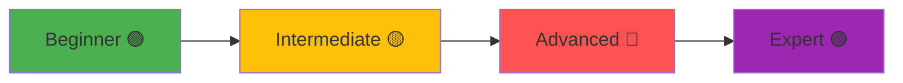
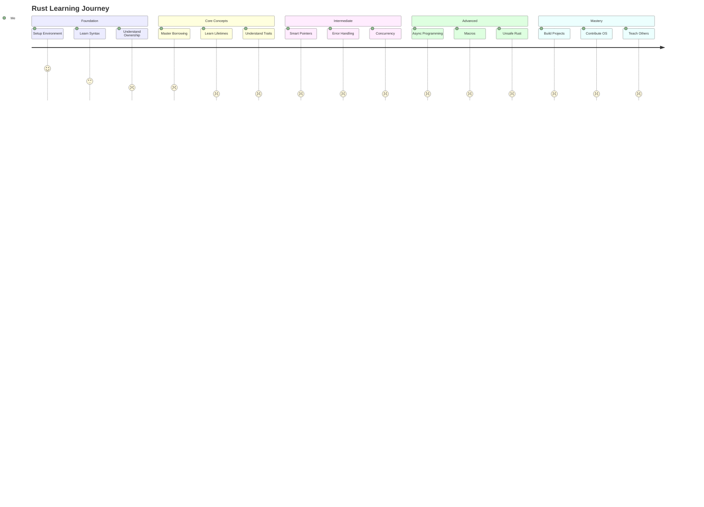

# 📈 Learning Progress Tracker

## 🎯 Overall Progress

**Current Level**: 🟢 Beginner
**Started**: [[2024-01-01]]
**Target**: 🟡 Intermediate by [[2024-06-01]]

## 📊 Skills Matrix

| Skill Area | Level (1-10) | Status | Notes |
|------------|--------------|--------|-------|
| **Основы синтаксиса** | ⬜⬜⬜⬜⬜⬜⬜⬜⬜⬜ 0/10 | 🔴 Not Started | |
| **Ownership & Borrowing** | ⬜⬜⬜⬜⬜⬜⬜⬜⬜⬜ 0/10 | 🔴 Not Started | |
| **Lifetimes** | ⬜⬜⬜⬜⬜⬜⬜⬜⬜⬜ 0/10 | 🔴 Not Started | |
| **Structs & Enums** | ⬜⬜⬜⬜⬜⬜⬜⬜⬜⬜ 0/10 | 🔴 Not Started | |
| **Traits** | ⬜⬜⬜⬜⬜⬜⬜⬜⬜⬜ 0/10 | 🔴 Not Started | |
| **Generics** | ⬜⬜⬜⬜⬜⬜⬜⬜⬜⬜ 0/10 | 🔴 Not Started | |
| **Error Handling** | ⬜⬜⬜⬜⬜⬜⬜⬜⬜⬜ 0/10 | 🔴 Not Started | |
| **Collections** | ⬜⬜⬜⬜⬜⬜⬜⬜⬜⬜ 0/10 | 🔴 Not Started | |
| **Iterators** | ⬜⬜⬜⬜⬜⬜⬜⬜⬜⬜ 0/10 | 🔴 Not Started | |
| **Closures** | ⬜⬜⬜⬜⬜⬜⬜⬜⬜⬜ 0/10 | 🔴 Not Started | |
| **Smart Pointers** | ⬜⬜⬜⬜⬜⬜⬜⬜⬜⬜ 0/10 | 🔴 Not Started | |
| **Concurrency** | ⬜⬜⬜⬜⬜⬜⬜⬜⬜⬜ 0/10 | 🔴 Not Started | |
| **Async/Await** | ⬜⬜⬜⬜⬜⬜⬜⬜⬜⬜ 0/10 | 🔴 Not Started | |
| **Macros** | ⬜⬜⬜⬜⬜⬜⬜⬜⬜⬜ 0/10 | 🔴 Not Started | |
| **Unsafe Rust** | ⬜⬜⬜⬜⬜⬜⬜⬜⬜⬜ 0/10 | 🔴 Not Started | |

## 📚 Learning Resources Progress

### Books
- [ ] **The Rust Book** (0/20 chapters)
  - [ ] Chapter 1: Getting Started
  - [ ] Chapter 2: Guessing Game
  - [ ] Chapter 3: Common Concepts
  - [ ] Chapter 4: Ownership
  - [ ] Chapter 5: Structs
  - [ ] Chapter 6: Enums
  - [ ] Chapter 7: Packages
  - [ ] Chapter 8: Collections
  - [ ] Chapter 9: Error Handling
  - [ ] Chapter 10: Generics, Traits, Lifetimes
  - [ ] Chapter 11: Testing
  - [ ] Chapter 12: I/O Project
  - [ ] Chapter 13: Iterators and Closures
  - [ ] Chapter 14: Cargo
  - [ ] Chapter 15: Smart Pointers
  - [ ] Chapter 16: Concurrency
  - [ ] Chapter 17: OOP
  - [ ] Chapter 18: Patterns
  - [ ] Chapter 19: Advanced
  - [ ] Chapter 20: Final Project

- [ ] **Rust by Example** (0/20 sections)
- [ ] **Async Book** (0/10 chapters)
- [ ] **Rustonomicon** (0/15 chapters)

### Exercises
- [ ] **Rustlings** (0/94 exercises)
  - [ ] Variables (6 exercises)
  - [ ] Functions (5 exercises)
  - [ ] If (2 exercises)
  - [ ] Primitive Types (6 exercises)
  - [ ] Vecs (2 exercises)
  - [ ] Move Semantics (6 exercises)
  - [ ] Structs (3 exercises)
  - [ ] Enums (3 exercises)
  - [ ] Strings (4 exercises)
  - [ ] Modules (3 exercises)
  - [ ] HashMaps (3 exercises)
  - [ ] Options (3 exercises)
  - [ ] Error Handling (6 exercises)
  - [ ] Generics (2 exercises)
  - [ ] Traits (5 exercises)
  - [ ] Tests (4 exercises)
  - [ ] Iterators (5 exercises)
  - [ ] Smart Pointers (4 exercises)
  - [ ] Threads (3 exercises)
  - [ ] Macros (4 exercises)
  - [ ] Clippy (3 exercises)
  - [ ] Conversions (5 exercises)

- [ ] **Exercism** (0/100 exercises)
- [ ] **Codewars** (0 kata completed)

## 🚀 Projects Completed

### Beginner Projects
- [ ] Guessing Game
- [ ] Temperature Converter
- [ ] Todo CLI
- [ ] Calculator

### Intermediate Projects
- [ ] Web Server
- [ ] Chat Application
- [ ] Parser

### Advanced Projects
- [ ] Database Engine
- [ ] Compiler
- [ ] OS Kernel

## 📅 Weekly Goals

### Week of [Current Week]
- [ ] Complete Rust Book Chapter X
- [ ] Solve 5 Rustlings exercises
- [ ] Work on [Current Project]
- [ ] Review flashcards daily
- [ ] Write one blog post about learnings

## 📊 Statistics

### Time Tracking
| Month | Hours | Focus Area |
|-------|-------|------------|
| January | 0 | Setup & Basics |
| February | 0 | - |
| March | 0 | - |
| April | 0 | - |
| May | 0 | - |
| June | 0 | - |

**Total Hours**: 0
**Daily Average**: 0
**Streak**: 0 days

### Code Metrics
- **Lines Written**: 0
- **Projects Started**: 0
- **Projects Completed**: 0
- **Commits**: 0
- **Pull Requests**: 0

### Learning Metrics
- **Concepts Learned**: 0
- **Flashcards Created**: 0
- **Flashcards Reviewed**: 0
- **Notes Created**: 0
- **Videos Watched**: 0

## 🏆 Achievements & Milestones

### Unlocked
- [ ] 🎯 First Rust Program
- [ ] 📚 Finished Rust Book
- [ ] 💪 100 Rustlings Exercises
- [ ] 🚀 First Real Project
- [ ] 🌟 1000 Lines of Code
- [ ] 🔥 30 Day Streak
- [ ] 💎 Published First Crate
- [ ] 🏅 Contributed to Open Source

### In Progress
- Working towards: [Current Goal]

## 🗺️ Learning Roadmap

## 💭 Reflection Notes

### What's Working Well
- 

### Challenges
- 

### Next Focus Areas
- 

### Resources Needed
- 

## 🎯 Long-term Goals

### 3 Months
- [ ] Complete Rust Book
- [ ] Build 3 projects
- [ ] Solve 100 exercises

### 6 Months
- [ ] Understand async/await
- [ ] Contribute to open source
- [ ] Build a production app

### 1 Year
- [ ] Master advanced concepts
- [ ] Publish a crate
- [ ] Give a talk/write articles

## 🔗 Related Pages

- [[🦀 Rust Learning Hub|Main Hub]]
- [[01_Core/00_Index|Core Concepts]]
- [[03_Projects/00_Index|Projects]]
- [[04_Flashcards/00_Index|Flashcards]]
- [[06_Daily/00_Template|Daily Notes]]

---
#rust #progress #tracking #learning #goals
