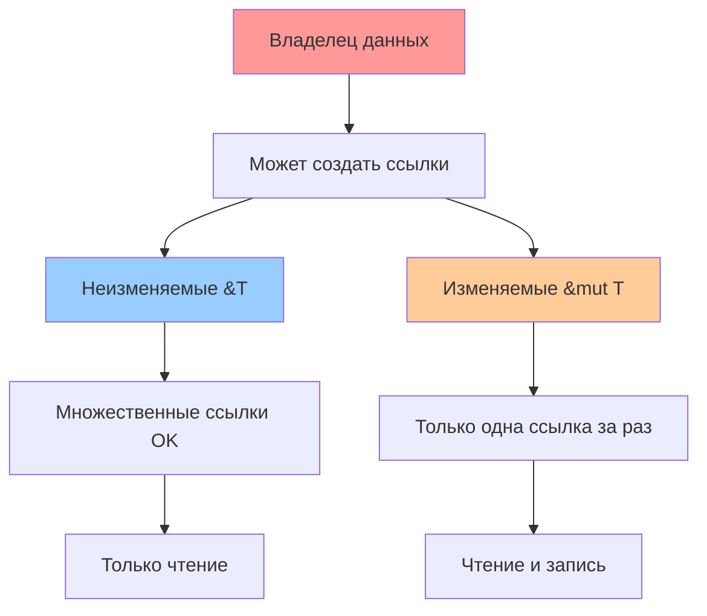

# 🔄 Заимствование (Borrowing) в Rust

Заимствование позволяет использовать значения без получения владения ими.

## 🎯 Основы заимствования

Заимствование - это создание ссылки на значение без получения владения.

```rust
fn main() {
    let s1 = String::from("hello");
    let len = calculate_length(&s1); // &s1 создаёт ссылку на s1
    println!("Length of '{}' is {}", s1, len); // s1 всё ещё доступна!
}

fn calculate_length(s: &String) -> usize { // s - это ссылка на String
    s.len()
} // s выходит из области видимости, но поскольку она не владеет данными,
  // ничего не происходит
```

## 📖 Типы заимствования

### 1️⃣ Неизменяемое заимствование (`&T`)
```rust
let s = String::from("hello");
let r1 = &s; // неизменяемая ссылка
let r2 = &s; // можно создать несколько неизменяемых ссылок
println!("{} and {}", r1, r2); // ✅ OK!
```

### 2️⃣ Изменяемое заимствование (`&mut T`)
```rust
let mut s = String::from("hello");
let r1 = &mut s; // изменяемая ссылка
r1.push_str(", world");
println!("{}", r1); // ✅ OK!
```

## ⚖️ Правила заимствования

### Правило 1: Эксклюзивность изменяемых ссылок
**Может существовать либо одна изменяемая ссылка, либо любое количество неизменяемых ссылок**

```rust
let mut s = String::from("hello");

// ❌ Это не работает:
let r1 = &s;     // неизменяемая ссылка
let r2 = &s;     // ещё одна неизменяемая ссылка  
let r3 = &mut s; // ❌ ОШИБКА! Нельзя создать изменяемую ссылку
                 // когда есть неизменяемые

// ✅ Это работает:
let r1 = &s;
let r2 = &s;
println!("{} and {}", r1, r2);
// r1 и r2 больше не используются после этой точки

let r3 = &mut s; // ✅ OK! Неизменяемых ссылок больше нет
println!("{}", r3);
```

### Правило 2: Область видимости ссылок
Ссылки валидны только пока существует их область видимости:

```rust
let mut s = String::from("hello");

let r1 = &s;
let r2 = &s;
println!("{} and {}", r1, r2); // r1 и r2 больше не используются

let r3 = &mut s; // ✅ OK! r1 и r2 вышли из области видимости
println!("{}", r3);
```

## 🔍 Диаграмма заимствования



## 💡 Практические примеры

### Изменение через заимствование
```rust
fn main() {
    let mut s = String::from("hello");
    change(&mut s);
    println!("{}", s); // "hello, world"
}

fn change(some_string: &mut String) {
    some_string.push_str(", world");
}
```

### Функция с несколькими заимствованиями
```rust
fn main() {
    let s1 = String::from("hello");
    let s2 = String::from("world");
    
    let result = longest(&s1, &s2);
    println!("The longest string is {}", result);
}

fn longest(x: &str, y: &str) -> &str {
    if x.len() > y.len() {
        x
    } else {
        y
    }
}
```

## 🚨 Частые ошибки

### Попытка изменить через неизменяемую ссылку
```rust
let s = String::from("hello");
let r = &s;
// r.push_str(", world"); // ❌ Ошибка! r - неизменяемая ссылка
```

### Множественные изменяемые ссылки
```rust
let mut s = String::from("hello");
let r1 = &mut s;
let r2 = &mut s; // ❌ Ошибка! Только одна изменяемая ссылка за раз
println!("{}, {}", r1, r2);
```

### Смешивание изменяемых и неизменяемых ссылок
```rust
let mut s = String::from("hello");
let r1 = &s;     // неизменяемая ссылка
let r2 = &mut s; // ❌ Ошибка! Нельзя создать изменяемую ссылку
println!("{}, {}", r1, r2); // пока активны неизменяемые
```

## 🎓 Ключевые принципы

1. **Безопасность**: Заимствование предотвращает data races во время компиляции
2. **Эффективность**: Ссылки не имеют накладных расходов во время выполнения  
3. **Контроль**: Компилятор точно знает, когда данные можно безопасно изменять

## 🔗 Связанные темы
- [[References]] - Подробнее о типах ссылок
- [[Mutable-References]] - Работа с изменяемыми ссылками
- [[09-Lifetimes/Lifetimes-Basics]] - Времена жизни ссылок
- [[Reference-Rules]] - Детальные правила для ссылок

## 🧪 Упражнения для практики

1. Напишите функцию, которая принимает неизменяемую ссылку на вектор и возвращает его длину
2. Создайте функцию для изменения строки через изменяемую ссылку
3. Исправьте код с ошибками заимствования

#borrowing #references #memory-safety #core-concept #intermediate