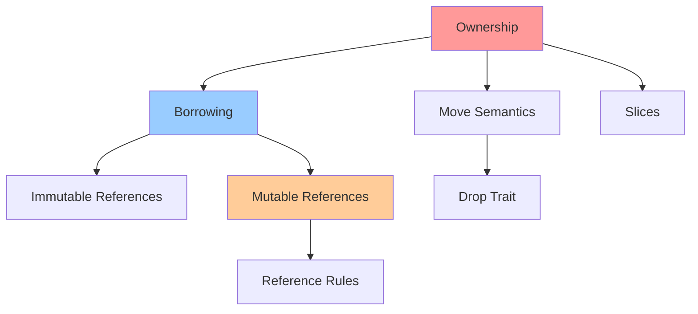

# 🔐 Система владения в Rust

Система владения (Ownership) - это уникальная особенность Rust, которая обеспечивает безопасность памяти без сборщика мусора.

## 📋 Содержание

### Основные концепции
- [[Ownership-Rules]] - Три правила владения
- [[Move-Semantics]] - Семантика перемещения
- [[Borrowing]] - Заимствование данных
- [[References]] - Ссылки и их виды
- [[Slices]] - Срезы массивов и строк

### Продвинутые темы
- [[Mutable-References]] - Изменяемые ссылки
- [[Dangling-References]] - Висячие ссылки
- [[Reference-Rules]] - Правила работы со ссылками

## 🕸️ Граф взаимосвязей

## 🎯 Ключевые правила

1. **Каждое значение имеет владельца**
2. **В каждый момент времени может быть только один владелец**
3. **Когда владелец выходит из области видимости, значение удаляется**

## 🔗 Связи с другими темами
- [[09-Lifetimes/README]] - Времена жизни ссылок
- [[13-Smart-Pointers/README]] - Альтернативы обычным ссылкам
- [[07-Error-Handling/README]] - Обработка ошибок владения

## ✅ Чек-лист освоения
- [ ] Понимаю три правила владения
- [ ] Различаю move и copy семантику
- [ ] Умею работать с заимствованиями
- [ ] Понимаю правила для ссылок
- [ ] Умею использовать срезы

#ownership-system #memory-safety #core-concept