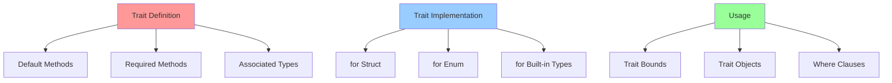

# 🎭 Трейты (Traits) в Rust

Трейты - это способ определения общего поведения для разных типов. Они похожи на интерфейсы в других языках, но более мощные.

## 📋 Содержание

### Основы трейтов
- [[Trait-Definition]] - Определение трейтов
- [[Trait-Implementation]] - Реализация трейтов для типов
- [[Default-Methods]] - Методы по умолчанию в трейтах
- [[Associated-Types]] - Ассоциированные типы

### Продвинутые концепции
- [[Trait-Objects]] - Динамическая диспетчеризация
- [[Trait-Bounds]] - Ограничения трейтов
- [[Where-Clauses]] - Сложные ограничения
- [[Higher-Ranked-Traits]] - Трейты высшего ранга

### Стандартные трейты
- [[Debug-Display]] - Debug и Display для вывода
- [[Clone-Copy]] - Копирование данных
- [[Eq-PartialEq]] - Сравнение на равенство  
- [[Ord-PartialOrd]] - Упорядочивание
- [[Drop-Trait]] - Освобождение ресурсов

## 🎯 Базовый пример

### Определение и реализация трейта
```rust
// Определяем трейт
trait Drawable {
    fn draw(&self);
    
    // Метод по умолчанию
    fn describe(&self) -> String {
        String::from("Это рисуемый объект")
    }
}

// Определяем структуры
struct Circle {
    radius: f64,
}

struct Rectangle {
    width: f64,
    height: f64,
}

// Реализуем трейт для Circle
impl Drawable for Circle {
    fn draw(&self) {
        println!("Рисуем круг с радиусом {}", self.radius);
    }
    
    fn describe(&self) -> String {
        format!("Круг радиусом {}", self.radius)
    }
}

// Реализуем трейт для Rectangle  
impl Drawable for Rectangle {
    fn draw(&self) {
        println!("Рисуем прямоугольник {}x{}", self.width, self.height);
    }
}
```

## 🔧 Практические применения

### Trait bounds (ограничения трейтов)
```rust
// Функция, принимающая любой тип, реализующий Drawable
fn draw_shape<T: Drawable>(shape: T) {
    shape.draw();
    println!("{}", shape.describe());
}

// Множественные ограничения
fn process_item<T: Drawable + Clone>(item: T) {
    let copy = item.clone();
    copy.draw();
}

// Where clause для сложных ограничений
fn complex_function<T, U>() 
where 
    T: Drawable + Clone,
    U: std::fmt::Debug,
{
    // Реализация
}
```

### Trait objects (объекты трейтов)
```rust
// Динамическая диспетчеризация
fn draw_shapes(shapes: Vec<Box<dyn Drawable>>) {
    for shape in shapes {
        shape.draw();
    }
}

fn main() {
    let shapes: Vec<Box<dyn Drawable>> = vec![
        Box::new(Circle { radius: 5.0 }),
        Box::new(Rectangle { width: 10.0, height: 20.0 }),
    ];
    
    draw_shapes(shapes);
}
```

## 📊 Диаграмма концепций трейтов



## 🛠️ Стандартные трейты

### Debug и Display
```rust
use std::fmt;

#[derive(Debug)] // Автоматическая реализация Debug
struct Point {
    x: i32,
    y: i32,
}

// Ручная реализация Display
impl fmt::Display for Point {
    fn fmt(&self, f: &mut fmt::Formatter) -> fmt::Result {
        write!(f, "({}, {})", self.x, self.y)
    }
}

fn main() {
    let p = Point { x: 1, y: 2 };
    println!("{:?}", p);  // Debug
    println!("{}", p);    // Display
}
```

### Clone и Copy
```rust
#[derive(Clone, Copy)]
struct SimpleStruct {
    value: i32,
}

#[derive(Clone)]
struct ComplexStruct {
    data: Vec<i32>,
}

// Copy можно реализовать только если все поля имеют Copy
// Clone можно реализовать для любого типа
```

### PartialEq и Eq
```rust
#[derive(PartialEq, Eq)]
struct Person {
    name: String,
    age: u32,
}

// Теперь можно сравнивать Person с помощью == и !=
let person1 = Person { name: "Alice".to_string(), age: 30 };
let person2 = Person { name: "Alice".to_string(), age: 30 };
assert_eq!(person1, person2);
```

## 🎯 Продвинутые техники

### Associated Types (ассоциированные типы)
```rust
trait Iterator {
    type Item;  // Ассоциированный тип
    
    fn next(&mut self) -> Option<Self::Item>;
}

struct NumberIterator {
    current: i32,
    max: i32,
}

impl Iterator for NumberIterator {
    type Item = i32;  // Конкретизируем ассоциированный тип
    
    fn next(&mut self) -> Option<Self::Item> {
        if self.current < self.max {
            let current = self.current;
            self.current += 1;
            Some(current)
        } else {
            None
        }
    }
}
```

### Conditional trait implementation
```rust
// Реализуем трейт только при определённых условиях
impl<T: Display> ToString for T {
    fn to_string(&self) -> String {
        format!("{}", self)
    }
}
```

## 🚨 Частые ошибки

### Orphan rule нарушение
```rust
// ❌ Нельзя: реализовать внешний трейт для внешнего типа
// impl fmt::Display for Vec<i32> { ... }

// ✅ Можно: обернуть в newtype
struct MyVec(Vec<i32>);
impl fmt::Display for MyVec { 
    fn fmt(&self, f: &mut fmt::Formatter) -> fmt::Result {
        write!(f, "{:?}", self.0)
    }
}
```

### Trait object limitations
```rust
trait MyTrait {
    fn method1(&self);
    fn method2() -> i32;  // ❌ Статические методы нельзя в trait objects
}

// ❌ Не object-safe
// let obj: Box<dyn MyTrait> = ...;

// ✅ Object-safe версия
trait ObjectSafeTrait {
    fn method1(&self);
}
```

## 💡 Лучшие практики

### 1. Предпочитайте композицию наследованию
```rust
// Вместо наследования используйте трейты
trait Flyable {
    fn fly(&self);
}

trait Swimmable {
    fn swim(&self);
}

struct Duck;
impl Flyable for Duck {
    fn fly(&self) { println!("Duck flying"); }
}
impl Swimmable for Duck {
    fn swim(&self) { println!("Duck swimming"); }
}
```

### 2. Используйте маркерные трейты
```rust
// Трейт без методов для маркировки типов
trait ThreadSafe {}

struct SafeStruct;
impl ThreadSafe for SafeStruct {}

fn process_safely<T: ThreadSafe>(data: T) {
    // Можем быть уверены, что T безопасен для многопоточности
}
```

### 3. Обобщённые реализации
```rust
// Реализация для всех типов, удовлетворяющих условию
impl<T: fmt::Display> MyTrait for T {
    fn show(&self) {
        println!("{}", self);
    }
}
```

## 🔗 Связанные темы
- [[10-Generics/README]] - Дженерики и трейты тесно связаны
- [[09-Lifetimes/README]] - Времена жизни в трейтах
- [[05-Structs-Enums/README]] - Применение трейтов к структурам

## 🧪 Практические упражнения

1. **Создайте трейт `Area`** с методом для вычисления площади
2. **Реализуйте трейт для разных фигур** (круг, прямоугольник, треугольник)
3. **Создайте функцию**, принимающую любую фигуру и выводящую её площадь
4. **Экспериментируйте с trait objects** для хранения разных фигур в векторе

#traits #interfaces #polymorphism #advanced #core-concept