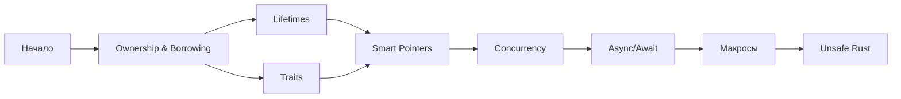

# 🦀 Rust Learning Hub

## 📚 Основные разделы

### [[01_Core/00_Index|🔸 Core Concepts]]
Фундаментальные концепции Rust

### [[02_Advanced/00_Index|🔹 Advanced Topics]]
Продвинутые темы и паттерны

### [[03_Projects/00_Index|🚀 Projects]]
Практические проекты и задачи

### [[04_Flashcards/00_Index|🎯 Flashcards]]
Карточки для запоминания

### [[05_Resources/00_Index|📖 Resources]]
Полезные ресурсы и ссылки

### [[06_Daily/00_Template|📝 Daily Notes]]
Ежедневные заметки по изучению

## 🗺️ Карта обучения

## 🎯 Текущий прогресс

- [ ] Основы синтаксиса
- [ ] Ownership и Borrowing
- [ ] Структуры и енумы
- [ ] Трейты и дженерики
- [ ] Error handling
- [ ] Многопоточность
- [ ] Async программирование

## 🔥 Quick Links

- [[Rust Cheatsheet]] - Быстрая справка
- [[Common Errors]] - Частые ошибки и решения
- [[Code Snippets]] - Полезные сниппеты
- [[Interview Questions]] - Вопросы для собеседования

---
#rust #learning #hub
